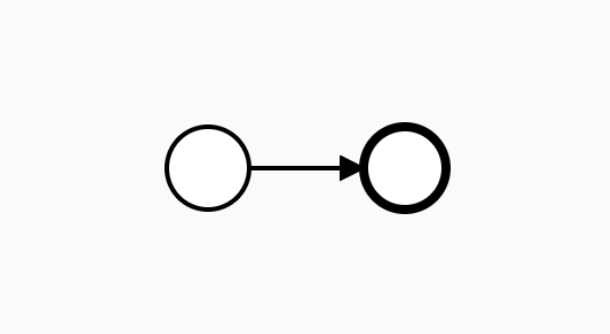
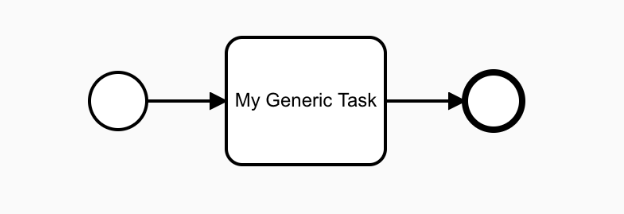
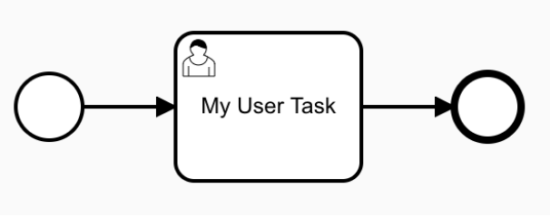

# Scenario Set 0: Process Information and Base BPMN Elements

These scenarios tests basic processes constructs such as BPMN Start/End events and the events generated by these elements should be tested. It also test the behaviour of a Base Tasks with no configuration. 
You can find the source code for these [comformance tests here](https://github.com/Activiti/Activiti/tree/develop/activiti-spring-conformance-tests/activiti-spring-conformance-set0).

- [Process Information](https://github.com/salaboy/bpmn-scenarios/blob/master/processes/Process%20Information.bpmn20.xml) 
  - The [source code for this test can be found here](https://github.com/Activiti/Activiti/blob/develop/activiti-spring-conformance-tests/activiti-spring-conformance-set0/src/test/java/org/activiti/spring/conformance/set0/ConformanceBasicProcessInformationTest.java).
  - Check that the process instance is COMPLETED (status) after start
  - Check that the process instance information is correctly propagated
    - businessKey
    - name
  - **Start Process Operation**
    - PROCESS_CREATED
    - PROCESS_STARTED
    - ACTIVITY_STARTED
    - ACTIVITY_COMPLETED
    - SEQUENCE_FLOW_TAKEN
    - ACTIVITY_STARTED
    - ACTIVITY_COMPLETED
    - PROCESS_COMPLETED
  - **Start Process Operation**
    - Add one process Variable
    - PROCESS_CREATED
    - VARIABLE_CREATED
    - PROCESS_STARTED
    - ACTIVITY_STARTED
    - ACTIVITY_COMPLETED
    - SEQUENCE_FLOW_TAKEN
    - ACTIVITY_STARTED
    - ACTIVITY_COMPLETED
    - PROCESS_COMPLETED

- [Process with Generic Task](https://github.com/salaboy/bpmn-scenarios/blob/master/processes/Process%20with%20Generic%20%20BPMN%20Task.bpmn20.xml) 
  - The [source code of this test can be found here](https://github.com/Activiti/Activiti/blob/develop/activiti-spring-conformance-tests/activiti-spring-conformance-set0/src/test/java/org/activiti/spring/conformance/set0/ConformanceBasicGenericTaskTest.java)
  - Check that the process instance is COMPLETED (status) after start, BPMN Generic task doesn’t have any associated behaviour so the task is automatically completed by the engine
  - Check that the process instance information is correctly propagated
    - businessKey
    - Name
  - **Start Process Operation**
    - PROCESS_CREATED
    - PROCESS_STARTED,
    - ACTIVITY_STARTED,
    - ACTIVITY_COMPLETED,
    - SEQUENCE_FLOW_TAKEN,
    - ACTIVITY_STARTED,
    - ACTIVITY_COMPLETED,
    - SEQUENCE_FLOW_TAKEN,
    - ACTIVITY_STARTED,
    - ACTIVITY_COMPLETED,
    - PROCESS_COMPLETED

- [Process Instance Delete](https://github.com/salaboy/bpmn-scenarios/blob/master/processes/UserTask%20with%20no%20User%20or%20Group%20Assignment.bpmn20.xml)
  - The [source code of this test can be found here](https://github.com/Activiti/Activiti/blob/develop/activiti-spring-conformance-tests/activiti-spring-conformance-set0/src/test/java/org/activiti/spring/conformance/set0/ProcessInstanceOperationsTest.java)
  - Start a process instance with a wait/safe state such as a UserTask
  - We will need to check for process events only, Task Events should be validated in Set 2
    - **Start Process Operation**
      - PROCESS_CREATED
      - PROCESS_STARTED
      - ACTIVITY_STARTED,
      - ACTIVITY_COMPLETED,
      - SEQUENCE_FLOW_TAKEN,
      - ACTIVITY_STARTED
    - **Delete Process Operator**
      - ACTIVITY_CANCELLED,
      - PROCESS_CANCELLED
  - After delete, we shouldn’t be able to find the process instance

- [Process Instance Suspend / Resume](https://github.com/salaboy/bpmn-scenarios/blob/master/processes/UserTask%20with%20no%20User%20or%20Group%20Assignment.bpmn20.xml) 
  - The [source code of this test can be found here](https://github.com/Activiti/Activiti/blob/develop/activiti-spring-conformance-tests/activiti-spring-conformance-set0/src/test/java/org/activiti/spring/conformance/set0/ProcessInstanceOperationsTest.java)
  - Start a process instance with a wait/safe state such as a UserTask
  - **Start Process Operation**
    - PROCESS_CREATED,
    - PROCESS_STARTED,
    - ACTIVITY_STARTED,
    - ACTIVITY_COMPLETED,
    - SEQUENCE_FLOW_TAKEN,
    - ACTIVITY_STARTED
  - **Suspend Process Operation**    
    - PROCESS_SUSPENDED
  - **Resume Process Operation**
    - PROCESS_RESUMED
