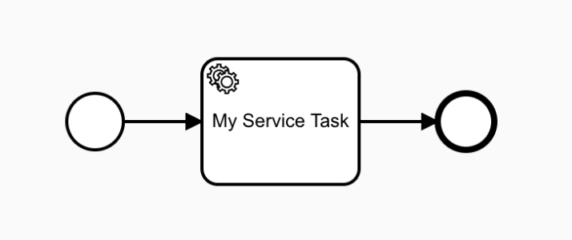

# Scenario Set 1: Basic Service Tasks
These scenarios cover the use of BPMN Service tasks and the events generated by processes including these kind of tasks. In order to cover the side effects that can be caused by an external (third party integration), these scenarios cover and validate the changes in process variables. The [source code of these tests can be found here](https://github.com/Activiti/Activiti/tree/develop/activiti-spring-conformance-tests/activiti-spring-conformance-set1).

- [Service Task with Implementation](https://github.com/salaboy/bpmn-scenarios/blob/master/processes/ServiceTask%20with%20Implementation.bpmn20.xml) 
  - Check that the process start and the status after start is COMPLETED, due the Connector is a sync operation
  - Check that the connector logic is executed
  - Check that the following Events are emitted
  - **Start Process Operation**
    - PROCESS_CREATED
    - PROCESS_STARTED,
    - ACTIVITY_STARTED,
    - ACTIVITY_COMPLETED,
    - SEQUENCE_FLOW_TAKEN,
    - ACTIVITY_STARTED,
    - ACTIVITY_COMPLETED,
    - SEQUENCE_FLOW_TAKEN,
    - ACTIVITY_STARTED,
    - ACTIVITY_COMPLETED,
    - PROCESS_COMPLETED
- [Service Task with Implementation and Variables](https://github.com/salaboy/bpmn-scenarios/blob/master/processes/ServiceTask%20with%20Implementation.bpmn20.xml) 
  - Check that the process start and the status after start is COMPLETED, due the Connector is a sync operation
  - Check that the connector logic is executed and the variable modified
  - Check that the following Events are emitted
  - **Start Process Operation**
    - PROCESS_CREATED
    - VARIABLE_CREATED
    - PROCESS_STARTED,
    - ACTIVITY_STARTED,
    - ACTIVITY_COMPLETED,
    - SEQUENCE_FLOW_TAKEN,
    - ACTIVITY_STARTED,
    - VARIABLE_UPDATED
    - ACTIVITY_COMPLETED,
    - SEQUENCE_FLOW_TAKEN,
    - ACTIVITY_STARTED,
    - ACTIVITY_COMPLETED,
    - PROCESS_COMPLETED
  - Check that the VARIABLE_UPDATED event contains the modified value
- [Service Task without Implementation](https://github.com/salaboy/bpmn-scenarios/blob/master/processes/ServiceTask%20without%20Implementation.bpmn20.xml)  
  