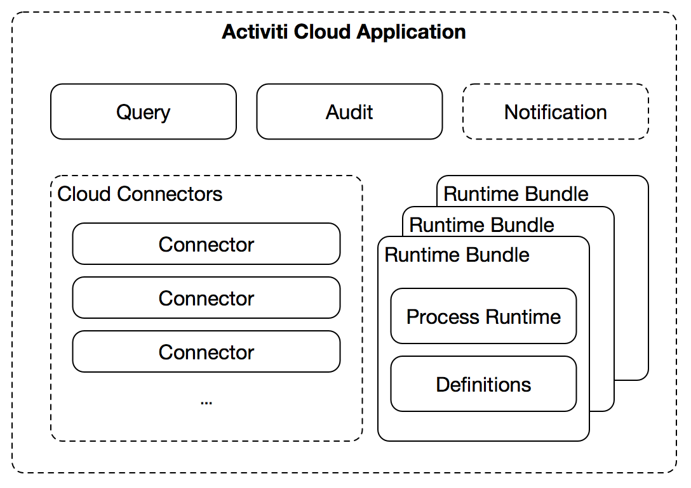

# Architecture Overview

Activiti Cloud provides a set of basic building blocks part of them are infrastructural services that will enable the whole platform to work and part of them are BPM specific. All these components were designed to be scalable independently one from the other and you are free to re-arrange them or replace them with your existing infrastructural services.

The following components are currently being developed:
- Activiti Cloud Infrastructure
	- [Activiti Cloud Gateway](activiti-cloud-infra/gateway.md)
	- [Activiti Cloud Registry](activiti-cloud-infra/registry.md)
	- [Activiti Cloud Single Sign On (SSO)](activiti-cloud-infra/sso.md)
	- [Activiti Cloud Identity Management (IDM)](activiti-cloud-infra/idm.md)
	- [Activiti Cloud Configuration Server](activiti-cloud-infra/config.md)
	- [Activiti Cloud Logging](activiti-cloud-infra/logging.md)
	- Storage / Databases
	- Message Brokers
- Activiti Cloud Applications
	- [Activiti Cloud Query Service](activiti-cloud-app/QueryService.md)
	- [Activiti Cloud Audit Service](activiti-cloud-app/AuditService.md)
	- [Activiti Cloud Notification Service](activiti-cloud-app/NotificationService.md)
	- [Activiti Cloud Runtime Bundles](activiti-cloud-app/RuntimeBundle.md)
	- [Activiti Cloud Connectors](activiti-cloud-app/CloudConnectors.md) 

We define a set of services that should be provided by the infrastructure, meaning that in different environments these components can be replaced by services provided by the underlaying infrastructure.
Other components will rely on these infrastructural services to work, meaning that a clear set of features must be provided for the Activiti Cloud Applications to work with all the designed features.

Activiti Cloud Applications are dynamic and they can be provisioned on runtime. We use runtime bundles to define application scopes. These Runtime Bundles encapsulates the Process Runtime and a fixed set of business processes (and versions) that we want to automate.

Following this approach, we will have two different Runtime Bundles if we decide to change one or more versions of our business processes.

Each of these Activiti Cloud Applications can define where to store the runtime state of its processes. This allows extreme flexibility on configuration to support a wide range of scenarios, but it also delegates the responsibility to the architects defining how the implementation will work. In order to simplify these decisions, sensitive defaults will be provided.

You can find examples and tutorials on how to use these services for your applications <HERE>.

You can also find <HERE> an example scenario using these technology.
