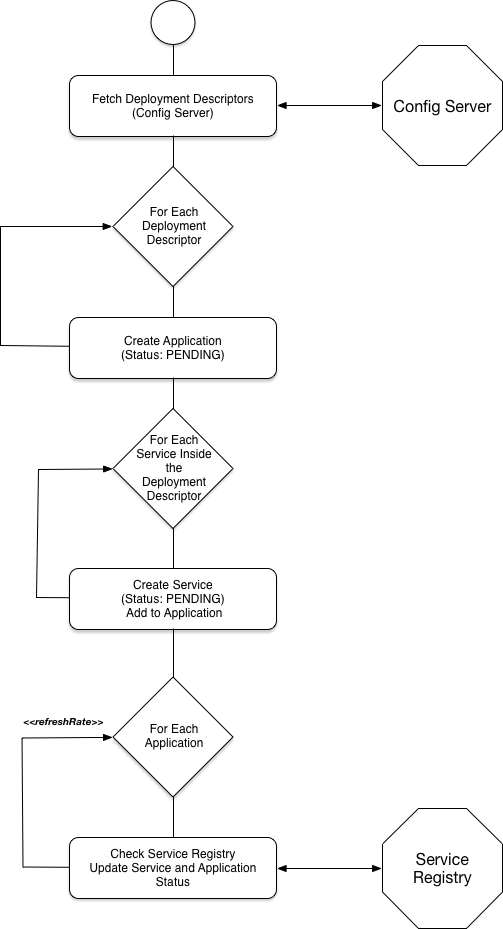

# Activiti Cloud Applications Service

The Application Service provides monitoring capabilities to arrange a set of Building Blocks into a logical Application. This service \(as other building blocks\) provides a Spring Boot Starter that you can add to an existing Spring Boot Application.

The Application Service Spring Boot Starter source code can be found here: [https://github.com/Activiti/activiti-cloud-app-service](https://github.com/Activiti/activiti-cloud-app-service)

The Application Service is not responsible for deploying/provisioning new applications, but it should expose operations such as the structure and status of the application to understand when applications are already provisioned and ready to receive requests. This means that for at least the initial version of this service most of the operations will be READ only. This service should react to changes in the environment \(new service registration/de-registration\) to make sure that the Application Service is providing data that is up to date and reflecting the real status of the deployments, this can be achieved by monitoring the Service Registry.

The Application Service should also interact with the Configuration Service to understand each application and its infrastructural services configurations and dependencies. For example: if Runtime Bundle \(one of our core building blocks\) depends on a Relational Database and a Message Broker, it can look into a Configuration Service \(or configMaps\) for an entry related to the application service to understand which infrastructural services are required for the application to run. We can be smart and list these requirements before deployment time, so an administrator can make sure that those infrastructural services are ready.

Applications have a relationship with IDM and security, because we are using Keycloak as our SSO and IDM provider, Applications might require to have a different realm configuration.

The Application Service has relationships with 4 key components:

* Configuration Service \(ConfigMaps in K8s and Configuration Service in Spring Cloud\)
* Service Registry \(Eureka outside of K8s and the K8s Service Registry\)
* Gateway \(Spring Cloud Gateway\)
* Identity Management / SSO \(KeyCloak\)

In order to provide these high level abstractions \(one application composed by a set of services\) we need to have an Application Deployment Descriptor, which basically describe the Application expected structure. This Deployment Descriptor describes how the application is composed and implicitly define what is required for the Application to be UP \(state\).

For this reason, the first step of the interaction is to create this high level Deployment Descriptor. This high level Deployment Descriptor maps the Activiti Cloud Building Blocks \(Runtime Bundles, Cloud Connectors, Query & Audit Services, etc.\) to an Application structure.

This Deployment Descriptor will live inside the Config Server, which has a structure to store Deployment Descriptors in a directory fashion. In other words, the Deployment Descriptor Directory will have a list of Application Deployment Descriptors available, that can be queried to obtain references to the available Deployment Descriptors for Applications.

This Deployment Descriptors will be used to match against the Service Registry the status of each Application.

Each Service provisioned will require to have two pieces of MetaData that will allow the correlation against these Deployment Descriptors:

* Activiti Cloud Application Name
* Activiti Cloud Service Type

If these two pieces of information are added to the Service Instance information inside the Service Registry, the Application Service will be able to correlate, validate and monitor the relationship between the services that are currently deployed.

Notice that all services that doesn’t belong to an application, will be grouped together.

The Application Service then, will be in charge of interacting with the Service Registry to answer questions about the amount of deployed applications and their respective state.

The sequence of interactions is as follows:

It is important to notice that there is no state storing as part of the Application Service, all state is created based on the Deployment Descriptors in the Config Service and based on the currently deployed services in the Service Registry.

## Data Types

As the first Draft of the service the following Data Types are going to be introduced.

These entities and data types should be agnostic to the underlying implementation. These Data Types represent our view of the world when we think about Activiti Cloud Applications, and we shouldn’t assume any particular implementation or technology stack.

* ApplicationDeploymentDirectory
  * ApplicationDeploymentEntry\[\]
* DeploymentDescriptor
  * applicationName
  * applicationVersion
  * serviceDeploymentDescriptors\[\]
    * Name
    * Version
    * ServiceType
* Application\[\]
  * Application
    * Name
    * Version
    * ProjectRelease
    * Realm \(Security Group / IDM bindings\)
    * Status
    * Services
      * URL \(path??\)
      * Configurations\[\]
        * Resources\[\]
      * ServiceType
      * Name \(Descriptive name\)
      * ArtifactName \(artifact – maven / docker image\)
      * Version
      * Status
* ServiceType -&gt; Enum:  \(Connector, Runtime Bundle, Audit, Query, Domain Service\)
* ProjectRelease \(Coming from Modeling Service\)
* Status \(UP, DOWN, PENDING, ERROR\)
* Realm \(TBD\)

## REST endpoints

The application service expose the /v1/apps/ endpoint which answers the questions of how many applications are up and running and the state of each individual app. This service can be used in conjunction with the Gateway component to decide when to register routes for each individual application.

This service also expose a deployment descriptor directory. This directory represents the definition of which applications will be "controlled" and monitored by this service. These descriptors can be updated dynamically, for example in the centralized configuration service. Deployment Descriptors can be compared with HELM charts, but these descriptors represent a higher level abstractions of the structure of the apps. In general there will be a one to one mapping to a HELM chart.

### Applications Endpoints

* GET /v1/apps/
* GET /v1/apps/{app\_id}
* GET /v1/apps/{app\_id}/status
* GET /v1/apps/{app\_id}/services

### Deployment descriptors Endpoint

* GET /v1/deployments/directory
* GET /v1/deployments/{app\_id}

