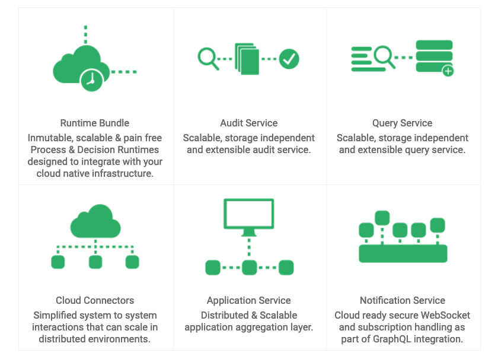
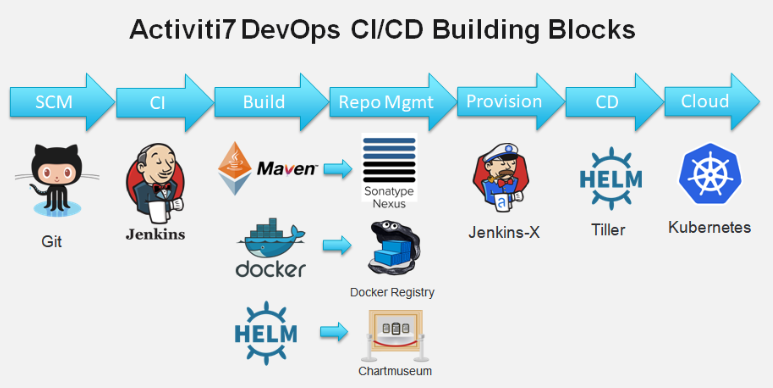

# Getting Started - Activiti Cloud with Jenkins-X

## What is Activiti Cloud?

Activiti Cloud is the new generation of business process automation platform offering a set of cloud native building blocks designed to run on distributed infrastructures in Kubernetes.

Activiti Cloud Architecture:

Activiti Cloud CI/CD has adopted open source Jenkins-X CI/CD project to make it simple for developers to work using DevOps principles and best practices in order to accelerate building and deploying process driven applications in the Cloud.

## What is Jenkins-X?

Jenkins X builds on top of Kubernetes to provide automated Continuous Integration and Continuous Delivery (CI/CD), making it easy for teams to move to Kubernetes and automate their CI/CD using best practices intended to reduce the time between committing a change to a system and the change being placed into normal production, while ensuring high quality. This approach enables to solve the following problems:

* Faster time to market
* Improved deployment frequency
* Shorter time between fixes
* Lower failure rate of releases
* Faster Mean Time To Recovery

We provide steps how to leverage the power of cloud provider services to create a solid foundation for Activiti Cloud CI/CD pipelines based on the Jenkins X project.

## GKE or EKS

The services available differ across cloud providers. So far we have specific instructions for getting started with GKE or with Amazon EKS.

### [Amazon Elastic Kubernetes Services Instructions](amazon-eks-jx.md)

### [Google Kubernetes Engine Instructions](google-cloud-gke-jx.md)
