# Activiti Cloud Quickstart with Amazon EKS and Jenkins-X

## Setup Overview

The diagram below shows an EKS cluster deployed in AWS and exposed to the outside world using Network Load Balancer [NLB](https://docs.aws.amazon.com/elasticloadbalancing/latest/network/introduction.html) and Route 53 domain mapping. 

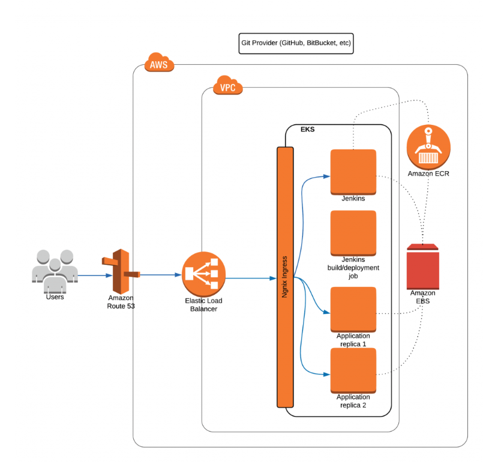

Jenkins-X platform is then deployed and configured with Git provider to trigger Kubernetes-based pipelines which produce Docker images pushed into private Elastic Container Registry (ECR).  Jenkins-X will also deploy our Activiti Cloud Helm chart into an EKS cluster and expose it via ingress to the outside world. 

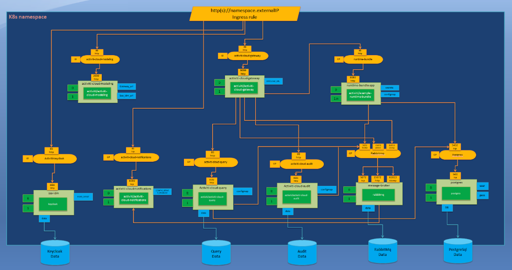

The diagram above uses Kubernetes Deployment Language: https://github.com/raffaelespazzoli/kdl

All of the persistence volume claims of Activiti Cloud infrastructure and applications will be handled by Amazon services using Amazon Elastic Block Store (Amazon EBS), which will be used to provision Kubernetes persistent volumes for Audit, Query, and Runtime Bundle using PostgreSQL database service.

## The Short Version

In case, you know what you are doing, get Jx from https://jenkins-x.io/getting-started/install/ and then follow the short version:

```
export AWS_ACCESS_KEY_ID=1234567890
export AWS_SECRET_ACCESS_KEY=123456789
export CLUSTER_NAME=activiti-cloud

$ jx upgrade cli

$ jx create cluster eks \
--cluster-name=$CLUSTER_NAME \
--skip-installation=true \
--node-type='m5.xlarge' \
--nodes=3 

$ jx install \
--provider=eks \
--no-default-environments

```

Then, skip to *Let’s Deploy Activiti Cloud in EKS* section at the end of this document.

## The Long version

### Configuring Domain Name using Nip.io

In case, we don’t need the real domain name, Jenkins-X provides support to use wildcard DNS nip.io service.  The nip.io allows to resolve any IP Address in the following DNS wildcard entries:

10.0.0.1.nip.io --> 10.0.0.1
app.10.0.0.1.nip.io --> 10.0.0.1
customer1.app.10.0.0.1.nip.io --> 10.0.0.1
customer2.app.10.0.0.1.nip.io --> 10.0.0.1
otherapp.10.0.0.1.nip.io --> 10.0.0.1

Simply put NIP.IO maps <anything>.<IP Address>.nip.io to the corresponding <IP Address>, simply by resolving 127.0.0.1.nip.io -> 127.0.0.1

To use nip.io DNS name, Jenkins-X will install and resolve the IP address of the Network Load Balancer during setup. Then the jenkins.1.2.3.4.nip,io DNS name would resolve to IP address, 1.2.3.4 giving wildcard DNS without need to configure DNS in Route 53.

## Configuring Domain Name in Route 53

To access our EKS cluster by domain name, we need to configure a real domain that will be used by users to access Activiti Cloud application and by DevOps team to access our Jenkins server.

In order to add a domain to AWS, choose Route 53 Service from the AWS console and click the blue Create Hosted Zone button. In the dialog box, type the name of your domain and click the blue Create button. 


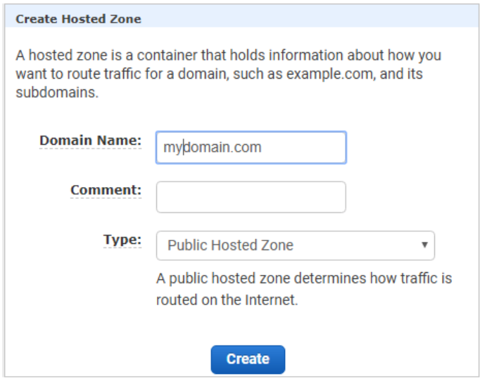

After creating the hosted zone, you should see it in your Route 53 console below. You should configure your domain to delegate to the AWS name servers defined in NS record of your hosted zone as shown here:

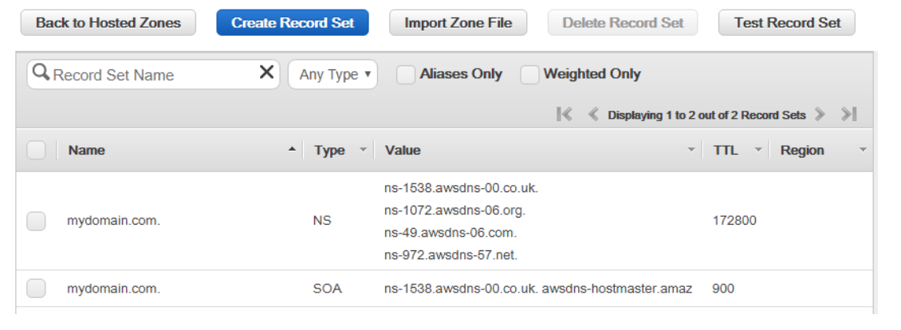

### Installing the Jenkins-X Cli

The Jenkins X provides Cli client called ‘jx’ (https://github.com/jenkins-x/jx). It is used to manage the Jenkins X infrastructure and Continuous Delivery pipelines. Detailed instructions on how to install jx, can be found https://jenkins-x.io/getting-started/install/

After successful installation of jx client you should now be able to display the jx client version by executing the following command:

```
$ jx version
NAME               VERSION
Jx                 1.3.836
```

#### Upgrade Warning for jx

jx version is aggressive about upgrading, so much so that the version command prompts to upgrade to the latest (if a newer is available). The default is Y , yes. To remove variables when using this GitOps approach, this author recommends saying n , no. Leave the upgrading of Jenkin-x to a purposeful plan both on the client and deployed infrastructure, ensuring both are always a match.

```
~ $ jx version
Failed to find helm installs: failed to run 'helm list' command in directory '', output: 'Error: Get https://localhost:6443/api/v1/namespaces/kube-system/pods?labelSelector=app%3Dhelm%2Cname%3Dtiller: dial tcp [::1]:6443: connect: connection refused': exit status 1
Failed to get kubernetes server version: Get https://localhost:6443/version?timeout=32s: dial tcp [::1]:6443: connect: connection refused
Failed to get kubectl version: Command failed 'kubectl version --short': Client Version: v1.13.2
The connection to the server localhost:6443 was refused - did you specify the right host or port? exit status 1

Failed to get helm version: failed to run 'helm version --short' command in directory '', output: 'Client: v2.12.2+g7d2b0c7
Error: Get https://localhost:6443/api/v1/namespaces/kube-system/pods?labelSelector=app%3Dhelm%2Cname%3Dtiller: dial tcp [::1]:6443: connect: connection refused': exit status 1
NAME VERSION
jx   1.3.126
git  git version 2.17.2 (Apple Git-113)

A new jx version is available: 1.3.769
? Would you like to upgrade to the new jx version? No

```

### Installing the Git Cli

In order to setup Jenkins-X in Kubernetes with Git provider for CI/CD GitOps, we need to create  a user account on Github to host Jenkins-X environment repositories. We will also need to install and configure Git Cli your local terminal console environment from https://git-scm.com/downloads

### Creating the EKS Kubernetes Cluster

JX will attempt to locate any required dependencies. If JX discovers that some dependencies are missing it will prompt to install them for you in the ~/.jx/bin folder. It is recommended that you allow jx to install any missing dependencies. You may also choose to install required dependencies for your OS manually:

* Aws Cli (https://docs.aws.amazon.com/cli/latest/userguide/cli-chap-install.html)
* eksctl (https://github.com/weaveworks/eksctl/releases)
* kubectl (https://kubernetes.io/docs/tasks/tools/install-kubectl/)
* Helm (https://helm.sh/),
* Heptio Authenticator for AWS (https://github.com/kubernetes-sigs/aws-iam-authenticator)

You can also pre-install any dependencies manually before we create the cluster.

#### Setting Up AWS Credentials

Ensure that you have your AWS credentials set up. The Jenkins X client is able to retrieve AWS credentials from standard AWS cli locations, including environment variables or ~/.aws config files. For the purposes of this example, we can just use environment variables:

```
$ export AWS_ACCESS_KEY_ID=1234567890
$ export AWS_SECRET_ACCESS_KEY=123456789
$ export CLUSTER_NAME=activiti-cloud
```

#### Creating EKS Cluster

Let’s create the new Kubernetes cluster with EKS using the following command:

Note: Jx cli simply wraps eksctl cli to create cluster using Aws api. You may choose to create cluster manually based on your requirements using eksctl command, if you know what you are doing.

```
$ jx create cluster eks \
--cluster-name=$CLUSTER_NAME \
--skip-installation=true \
--node-type='m5.xlarge' \
--nodes=3 
```

This will provision activiti-cloud EKS cluster with 3 nodes of type m5.xlarge (4CPU’s, 16GB RAM)

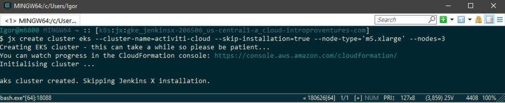

You can watch progress in the CloudFormation console: https://console.aws.amazon.com/cloudformation/

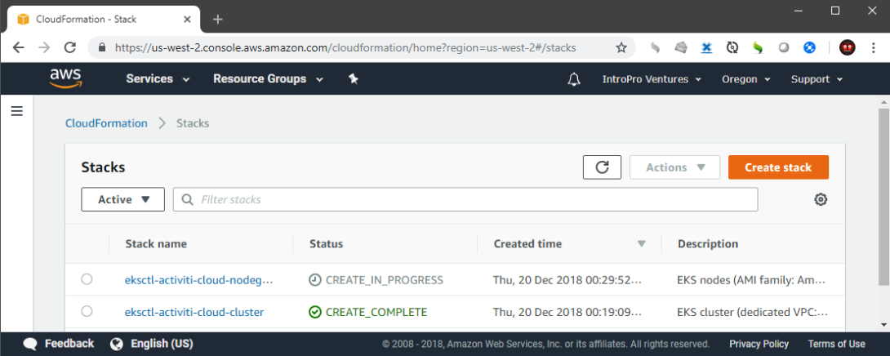

Execution of “jx create cluster” can take a while (~-20-25 min) while eksctl waits until the EKS cluster is fully initialized. As soon as the command finishes, you can verify installation using the following command:

```
$ jx get eks

NAME
activiti-cloud
```

### Installing the Jenkins X platform Into Your Kubernetes Cluster

Now that we have the EKS cluster up and running, we can install the Jenkins X platform into it. The Jenkins X platform consists of the Jenkins server itself, a Nexus server, configuration stored in Kubernetes, and a couple of other components, all packaged into single Helm chart. 

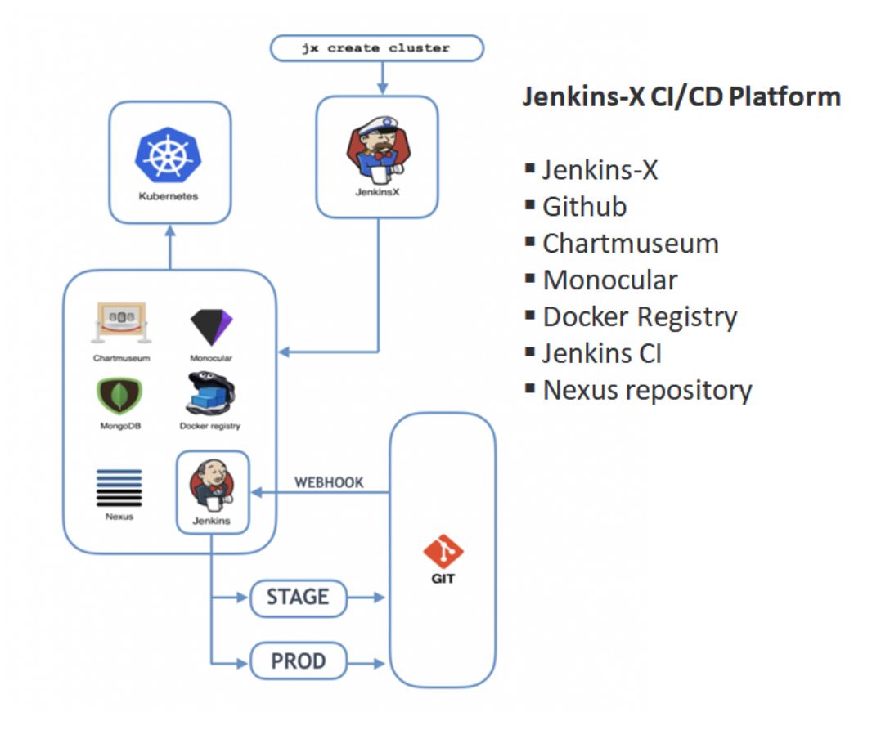

The Jenkins X platform can be installed using the following command without installing default environments repos. We will create Activiti Cloud Environments GitOps repos later. 

```
$ jx install \
--provider=eks \
--no-default-environments
```
Notes: To setup and use other than Github Git provider see: https://jenkins-x.io/developing/git/

During the installation process, jx may ask you to confirm some settings, mostly related to Git configuration and domain name. 

If you don’t have domain name configured in Route 53, choose not to register wildcard DNS name in Route 53 for you:

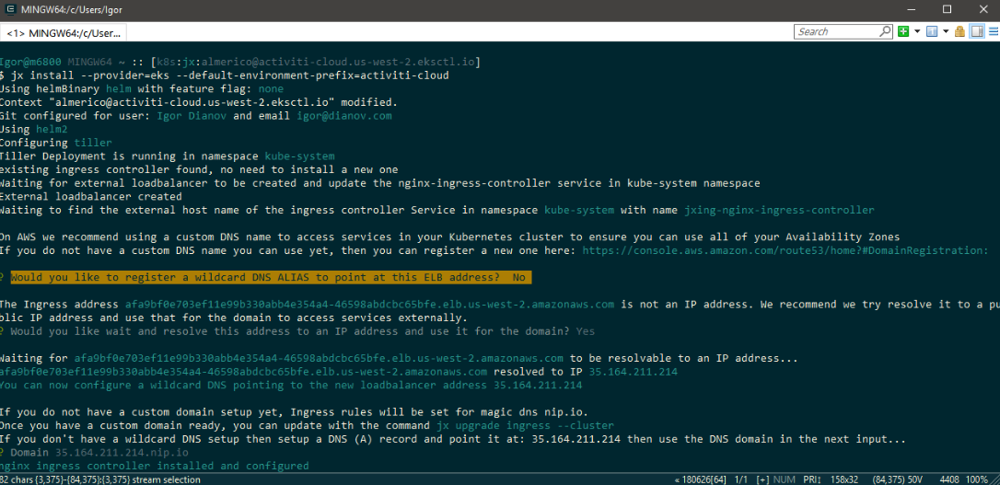

Jx requires to create a Git API token, which it will use to create and access Git repositories on your behalf. Follow the instructions from jx console to generate the API token (by clicking the link generated for you by jx). 

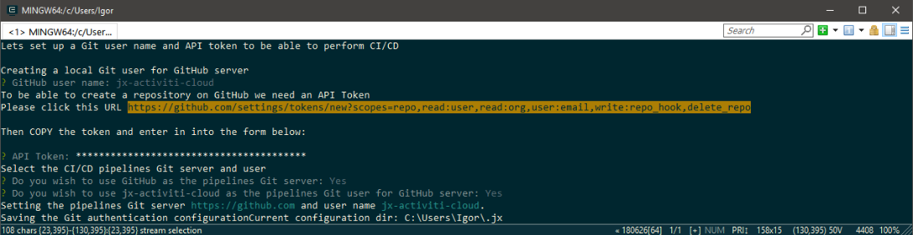

In the GitHub dialog window, specify the unique name i.e. activiti-cloud, of the token as shown below:

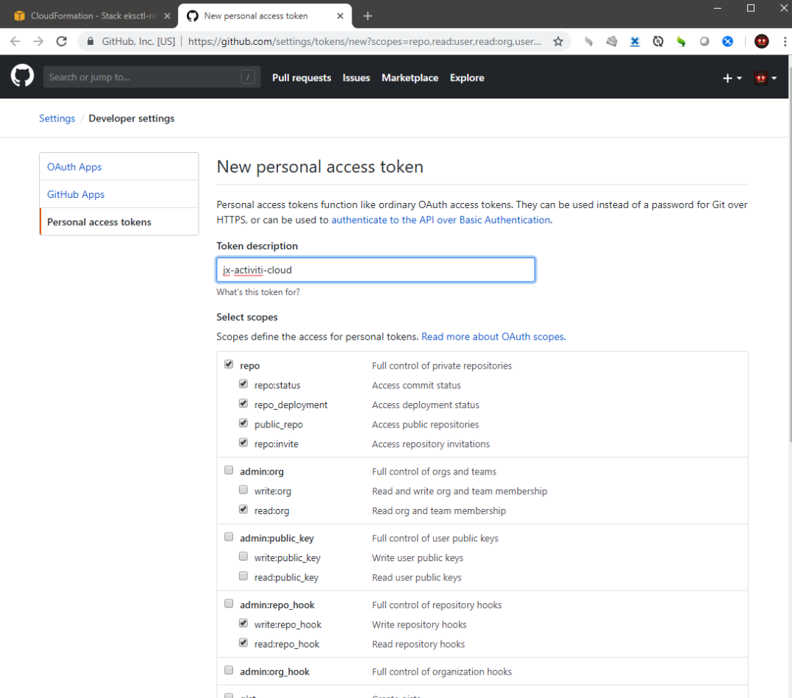

Then click the green Generate Token button, copy the value of the token, and paste it to the jx cli input.

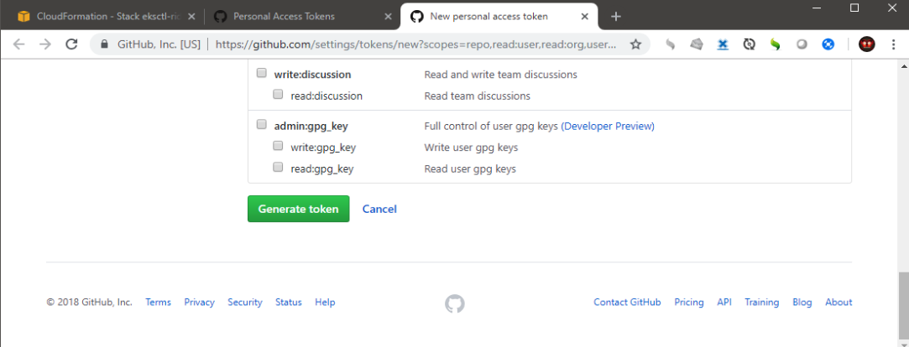
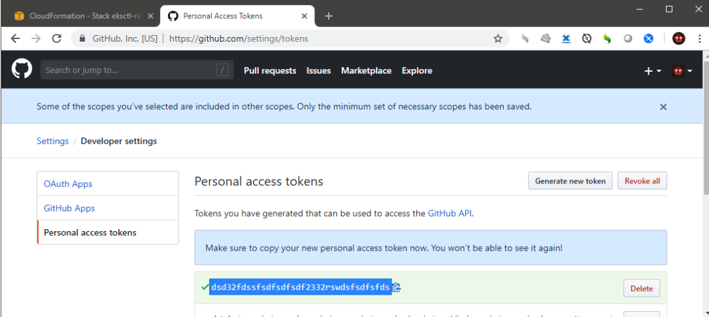

During the installation process you might notice that jx automatically opens the Jenkins server running on “http://jenkins.jx.35.164.211.214.nip.io/me/configure” address logs into it, and saves some settings. Jx uses headless browser automation to generate Jenkins API token on your behalf. This token will be later used internally by Jenkins X to automatically create Jenkins jobs on your behalf.

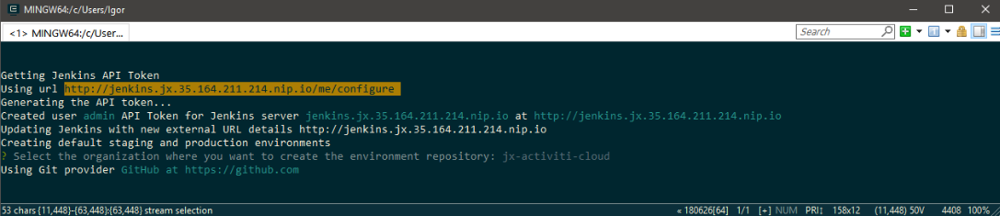

After a few minutes, the jx install command should finish creating the Jenkins X platform. It should also tell you the URL that you can use to access your Jenkins server, and a random admin password for this server.

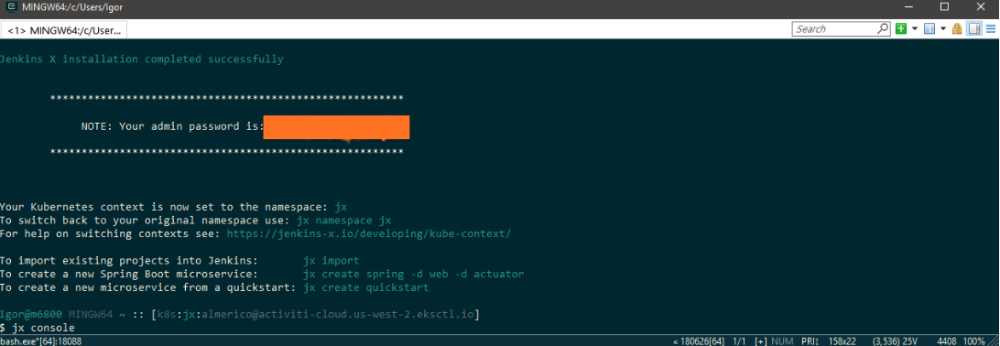

The URL to access Jenkins will printed in the output of the console together with random admin password auto-generated by jx  We now can use Jenkins credentials to log into our Jenkins server and see that Jenkins has successfully installed.

Note: after you have installed Jenkins-X, you may want to configure Jenkins-X to make all new repositories private by default with the following command:

```
$ jx edit gitprivate
```

To open Jenkins UI in the browser, run the following command::

```
$ jx console
```

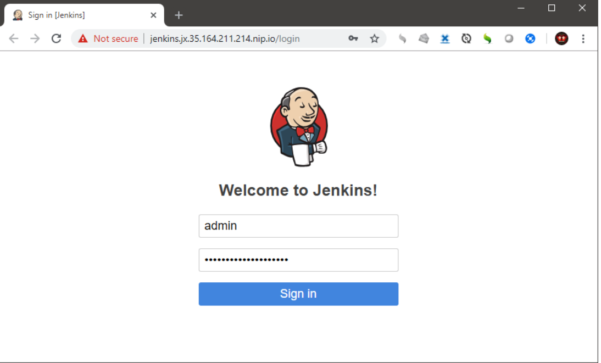

In the Jenkins UI, you can confirm that Jenkins X has successfully installed Jenkins instance:

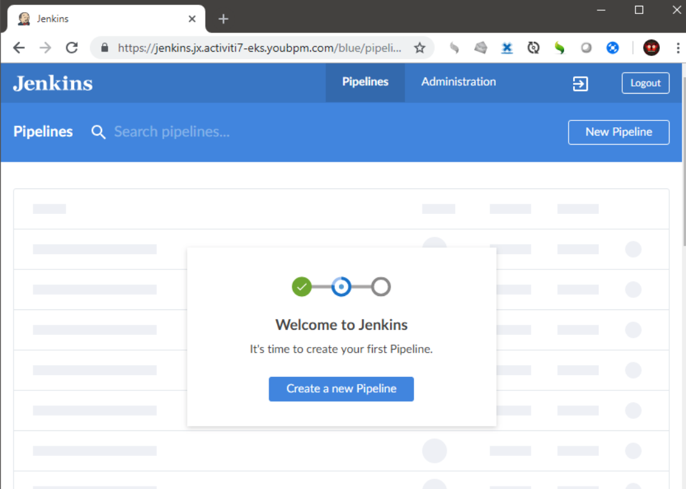

Close the Jenkins UI tab and go back to your shell.

## Let’s Now Deploy Activiti Cloud in EKS Cluster using Jenkins X CI/CD with GitOps Promotion

### Create Activiti Cloud Environments for GitOps

We will now proceed to provision two GitOps environments for deploying Activiti Cloud Platform: a staging environment and a production environment.

### Get Jx Cluster Domain

Set the following environment variables:
```
$ export CLUSTER_DOMAIN=$(kubectl get cm ingress-config -o=go-template --template='{{.data.domain}}' -n jx) && echo $CLUSTER_DOMAIN

$ export ENV_PREFIX=$CLUSTER_NAME && echo $ENV_PREFIX
```
### Create Activiti Cloud DevOps Environments

Run this command to configure environments using domain name of the cluster with the Activiti Cloud Environment Git repository used as the fork when creating new GitOps environment Git repo and custom environment repo prefix. Your Environment Git repo will be of the form 'environment-$prefix-$envName'

```
$ jx create env --domain $CLUSTER_DOMAIN \
	--fork-git-repo='https://github.com/activiti/activiti-cloud-environments.git' \
	--prefix=$ENV_PREFIX \
	--name=staging \
	--namespace=staging \
	--git-private=true \
	--promotion=Auto
$ jx create env --domain $CLUSTER_DOMAIN \
	--fork-git-repo='https://github.com/activiti/activiti-cloud-environments.git' \
	--prefix=$ENV_PREFIX \
	--name=production \
	--namespace=production \
	--git-private=true \
	--promotion=Manual
```
After Jx created new environments, run `jx console` command to open Jenkins UI, you can confirm that Jenkins X has successfully provisioned two environments for us: a staging environment and a production environment:
```
$ jx console
```

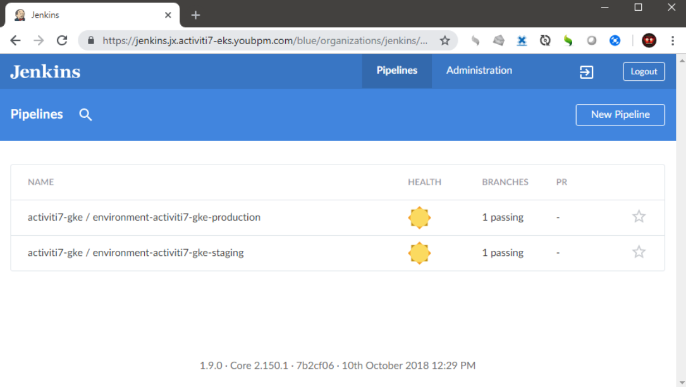

You can also navigate to GitHub and see that Jenkins X provisioned the projects representing the environments’ Helm chart definitions as just built by Jenkins.

