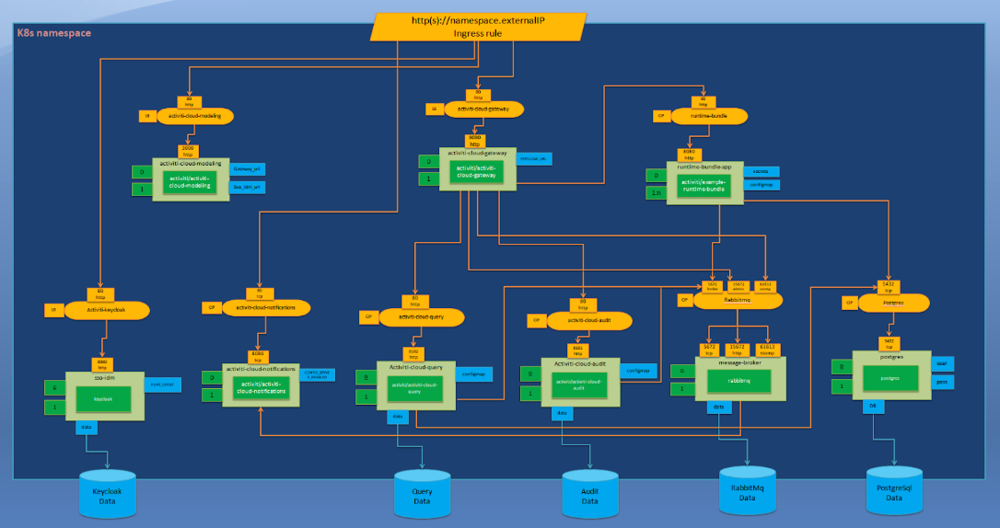

# Activiti Cloud Quickstart with Google Cloud GKE and Jenkins-X

## Setup Overview

The diagram below shows a GKE cluster deployed in GCP and exposed to the outside world using Network Load Balancer and Cloud DNS domain mapping. 

Jenkins-X platform is then deployed and configured with Git provider to trigger Kubernetes-based pipelines which produce Docker images pushed into private Google Container Registry (GCR).  Jenkins-X will also deploy our Activiti Cloud Helm chart into Namespace of a GKE cluster and expose it via Ingress to the outside world. 

