# Getting Started - Activiti Cloud

## Getting Started with Activiti Cloud

Activiti Cloud is a set of Cloud Native components designed from the ground up to work in distributed environments. We have chosen Kubernetes as our main deployment infrastructure and we are using Spring Cloud / Spring Boot along with Docker for containerization of these components.

We have gone through a very valuable journey, meeting very passionate developers, communities and existing and potential customers who are looking to leverage these technologies \(and business automation solutions\) to reduce time to market and improve business agility in the Cloud. We have also contributed with these communities, making sure that the Open Source projects that we consume get back our valuable feedback and contributions.

Activiti Cloud includes 4 foundational building blocks:

* Activiti Cloud Runtime Bundle
* Activiti Cloud Query
* Activiti Cloud Audit
* Activiti Cloud Connectors

These building blocks are Spring Boot Starters that can be attached to any Spring Boot \(2.x\) application. These building blocks are enhanced with Spring Cloud functionalities which provide the Cloud Native capabilities.

By using these components you can create Activiti Cloud applications that:

* can be scaled independently based on demand
* can be managed in completely isolated cycles
* can be upgraded and maintained independently
* can provide domain specific features using the right tool for the job

On this tutorial, we wanted to show how to get started by deploying an example set of these building blocks in Kubernetes. We strongly recommend having a real Kubernetes Cluster such as GKE, PKS or EKS. We have tested the content of this blog post in AWS \(Using Kops, PKS, GKE and also with Jenkins X\)

Let’s get started with Kubernetes, HELM and Activiti Cloud.

## Kubernetes Deployment & HELM Charts

The quickest and easiest way to deploy things to Kubernetes is by using HELM charts. HELM, as described in the official documentation, is: “_a tool that streamlines installing and managing Kubernetes applications. Think of it like apt/yum/homebrew for Kubernetes_.”

As part of Activiti Cloud, we have created a set of hierarchical HELM charts that can be used to deploy several components, some related to infrastructure \(such as SSO and Gateway\) and some Application specific components like Runtime Bundle, Audit Service, Query Service and a Cloud Connector.

These HELM charts can be found here: [https://github.com/Activiti/activiti-cloud-charts](https://github.com/Activiti/activiti-cloud-charts).

In this quick-start, we will be looking more specifically at: [https://github.com/Activiti/activiti-cloud-charts/tree/master/activiti-cloud-full-example](https://github.com/Activiti/activiti-cloud-charts/tree/master/activiti-cloud-full-example)

This “Activiti Cloud Full Example” deploys the following components:


One important thing to notice is that each of the Activiti Cloud components can be used independently. This example is intended to show a large-scale deployment scenario. You can start small with a Runtime Bundle \(which provides the process and task runtimes\), but if you want to scale things up you need to know what you are aiming for, and this charts shows you exactly that.

### Download and install Kubectl and HELM

* Kubectl : [https://kubernetes.io/docs/tasks/tools/install-kubectl/](https://kubernetes.io/docs/tasks/tools/install-kubectl/) 
* HELM: [https://docs.helm.sh/using\_helm/\#installing-helm](https://docs.helm.sh/using_helm/#installing-helm) 

Clone the [https://github.com/Activiti/activiti-cloud-charts](https://github.com/Activiti/activiti-cloud-charts) and go to the “activiti-cloud-full-example” directory, we will use some files from there.

## Create and configure the Google Kubernetes Engine \(GKE\) cluster

Using a real life cluster is recommended. As a free option, the Google Cloud Platform offers a $300 free credit: [https://console.cloud.google.com/freetrial](https://console.cloud.google.com/freetrial)

Once you have created your account, install the Google Cloud SDK CLI tool: [https://cloud.google.com/sdk/install](https://cloud.google.com/sdk/install)

Go to your Google Cloud Home Page \([https://console.cloud.google.com](https://console.cloud.google.com/)\) and select _**Kubernetes Engine / Clusters.**_ 

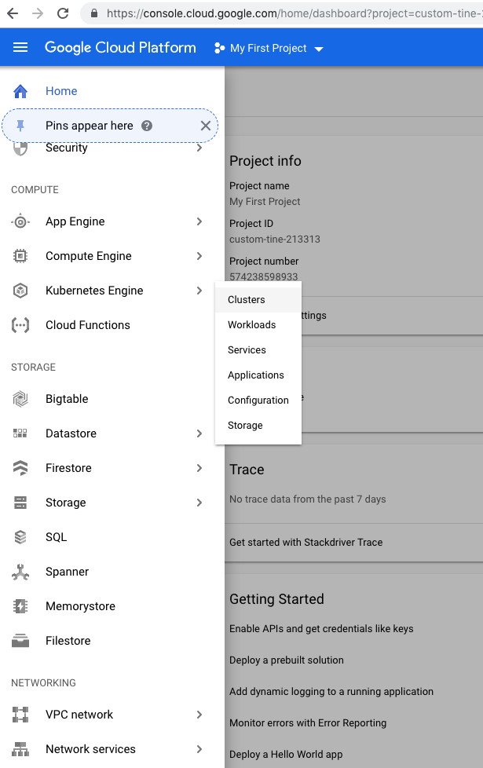

Then select the CREATE CLUSTER button  from  the top menu. 

Enter the Cluster Name, select the Zone based on your location and I’ve selected 2 vCPUs and left the Size to the default value \(3\).

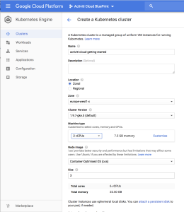

Once the cluster is created click on the Connect Button on the right hand side of the table:

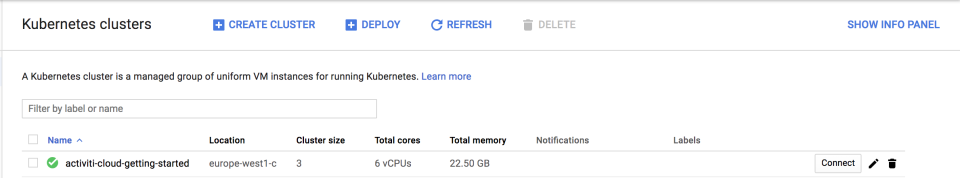

This will open a popup with a command to connect to the cluster. Copy it to your clipboard, open a terminal and paste the command into your terminal as shown below.

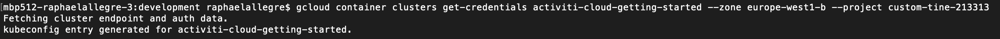

Now you have your cluster configured and ready to be used.


_Note: if you are working with an existing cluster, you will need to check if you have an Ingress Controller already installed, you can skip the following steps if that is the case._


Let's now configure HELM to work in the Cluster. We first need to give HELM permissions to deploy things into the cluster. Copy/clone/download the helm-service-account-role.yaml file from here: [https://github.com/Activiti/activiti-cloud-charts/blob/master/activiti-cloud-full-example/helm-service-account-role.yaml](https://github.com/Activiti/activiti-cloud-charts/blob/master/activiti-cloud-full-example/helm-service-account-role.yaml) \). 

Run the commands below in your terminal: 

```bash
kubectl apply -f helm-service-account-role.yaml
```

```bash
helm init --service-account helm --upgrade
```

Expected results:

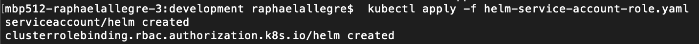

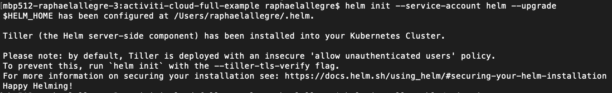

One more thing that we need to do in order to be able to expose our services to be accessed from outside the cluster is to set up an Ingress Controller, which will automatically create routes to the internal services that we want to expose, in order to do this we just need to run the following command:

```bash
helm install stable/nginx-ingress
```

Expected results:

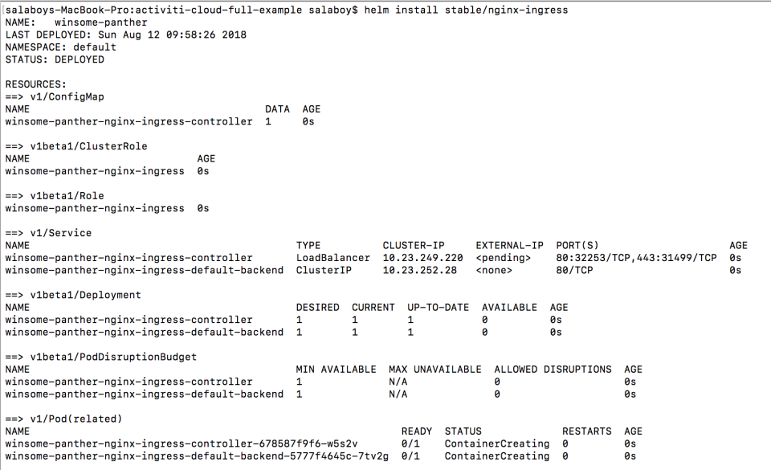

Now that NGINX Ingress Controller is being deployed, we need to wait for it to expose itself using a Public IP. We need this Public IP to interact with our services from outside the cluster. You can find this IP by running the following command:

```bash
kubectl get services
```

Expected results:

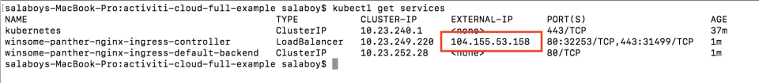


_Note: you might need to run kubectl get services serveral times until you can see the External IP for your ingress controller. If you see PENDING, wait for a few seconds and run the command again._


We will use nip.io as DNS service to map our services to this External IP which will follow the following format: ..nip.io

## Deploying Activiti Cloud Full Example

Now that we have our Cluster in place, HELM installed and an Ingress Controller to access our services from outside the cluster we are ready to deploy the Activiti Cloud Full Example HELM Chart.

The first step is to register the Activiti Cloud HELM charts into HELM. We do this by running the following commands:

```bash
helm repo add activiti-cloud-charts https://activiti.github.io/activiti-cloud-charts/
```

```bash
helm repo update
```

Expected results:

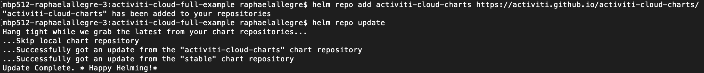

The next step is to configure your deployment to your cluster. The Activiti Cloud Full Example Chart can be customized to turn on and off different features, but there is one mandatory parameter that needs to be provided which is the external domain name that is going to be used by this installation.

In order to do this, download the values.yaml file located here: [https://github.com/Activiti/activiti-cloud-charts/blob/master/activiti-cloud-full-example/values.yaml](https://github.com/Activiti/activiti-cloud-charts/blob/master/activiti-cloud-full-example/values.yaml) . 

Replace the string “REPLACEME” to &lt;EXTERNAL-IP&gt;.nip.io.

In our case: 104.155.53.158.nip.io in every occurrence of “REPLACEME”.

Set the Activiti Cloud modeling to true.

```yaml
# Default values for activiti-cloud-full-example.
...

global:
  keycloak:
    url: "http://activiti-keycloak.104.155.60.221.nip.io/auth"
  gateway:
    host: &gatewayhost "activiti-cloud-gateway.104.155.60.221.nip.io"

activiti-cloud-modeling:
  enabled: true
...
infrastructure:
  activiti-keycloak:
    keycloak:
      enabled: true
      keycloak:
        ingress:
          enabled: true
          path: /
          proxyBufferSize: "16k"
          hosts:
            - "activiti-keycloak.104.155.60.221.nip.io"
 ...

```

Once you have performed  the 3 changes, deploy the chart by running the following command:

```bash
helm install -f values.yaml activiti-cloud-charts/activiti-cloud-full-example
```

Expected results:

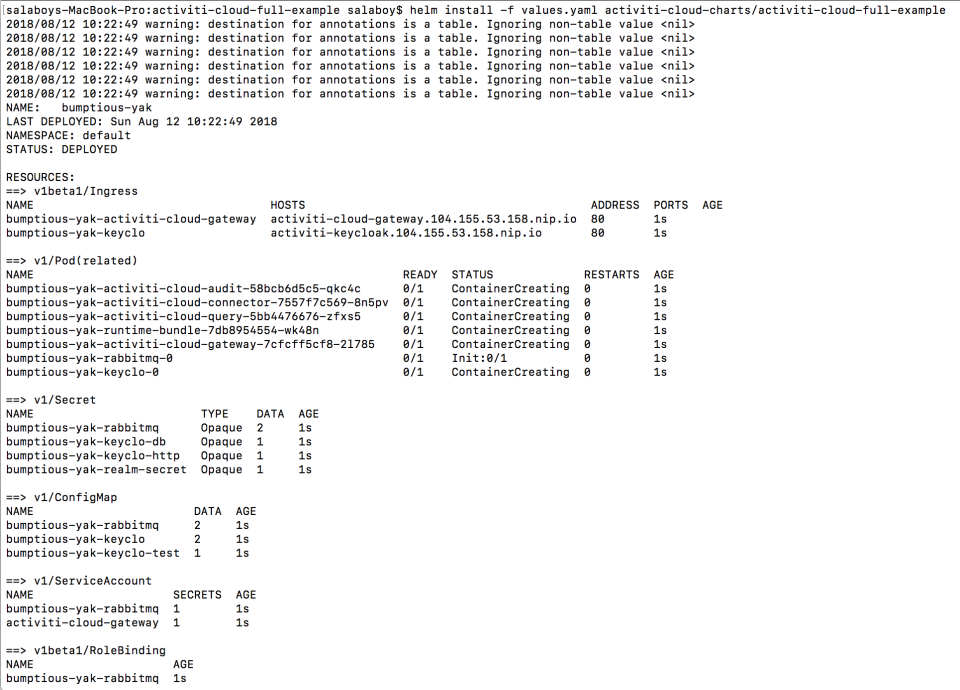

This will trigger the deployment process, and you need to wait until the services are up and running. You can check this by running:

```bash
kubectl get pods
```

Expected results:

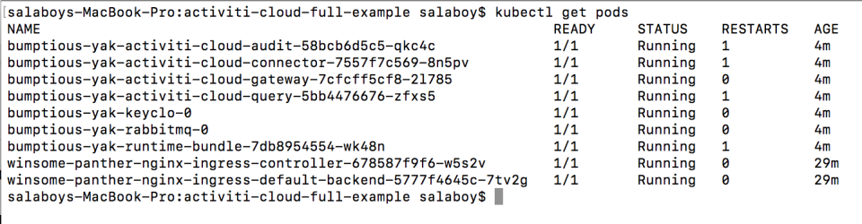


_Note: the READY column 1/1 in all the pods, that means that we have 1 pod in Kubernetes running our service. It is also important to notice that HELM created a release of our CHART. Because we haven’t specified a name for this release HELM choose one random name, in our case, it was: bumptious-yak. This means that we can manage this release independently of other Activiti Cloud Applications that we want to deploy using the same approach. You can run helm list and then helm delete to remove all the Activiti Cloud Services for this release._


In order to access to your services now, you can run the following command:

```bash
kubectl get ingress
```

Expected results:

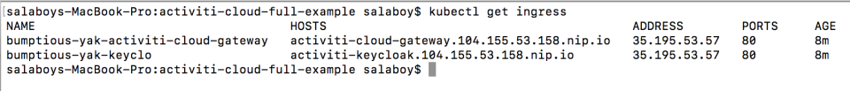

## Interacting with your Application

If you don't have it installed already, install the [Postman client](https://www.getpostman.com) on your machine. 

Then, download the Activiti Cloud Postman collection from the [Activiti Cloud Examples repository](https://github.com/Activiti/activiti-cloud-examples) using the command below \(copy/paste into your terminal\):

```bash

curl -o Activiti_v7_REST_API.postman_collection.json https://raw.githubusercontent.com/Activiti/activiti-cloud-examples/develop/Activiti%20v7%20REST%20API.postman_collection.json
```

Import the collection in Postman using _**Import**_ button.

Before calling any service you will need to create a new Environment in Postman. You can do that by going to the Manage Environment icon \(cog\)


Then “Add” a new environment and add a name to it. Now you need to configure the variables for the environment: “gateway”, “idm” and “realm”

For gateway you need to copy the url associated with your Ingress, the same for idm which is SSO and IDM using Keycloak. For the realm enter “activiti”:

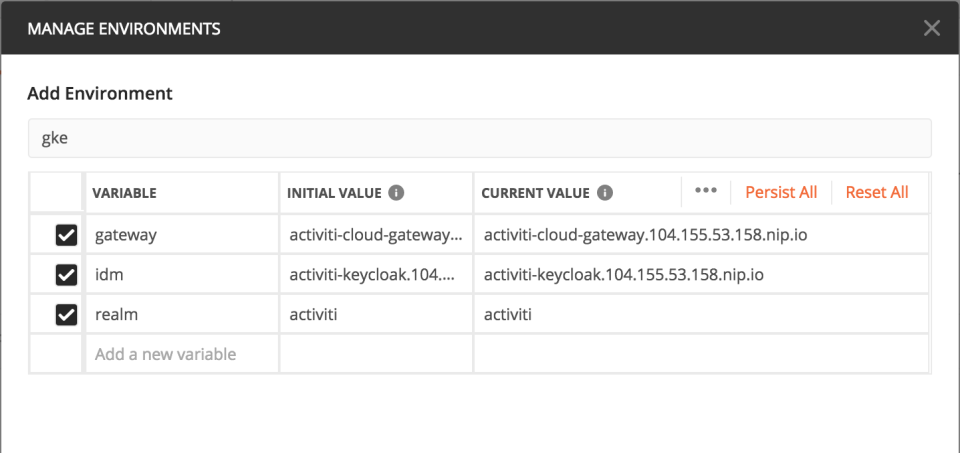

Click Save or Update and then you are ready to start using that Environment. Make sure that you select the environment in the dropdown of the right:


As shown in the previous screenshot, if you go to the _**keycloak**_ directory and select the “_**getKeycloakToken testuser**_” you will get the token which will be used to authenticate further requests. Notice that this token is time sensitive and it will be automatically invalidated so you might need to get it again if you start getting unauthorized errors.

Once you get the token for a user, you can interact with all the user endpoints. For example, you can create a request to see which Process Definitions are deployed inside our Example Runtime Bundle:


Now you can also start a new Process Instance from our SimpleProcess:


```bash
{
  "processDefinitionKey": "SimpleProcess",
  "variables": {
    "firstName": "salaboy",
    "lastName": "salaboy",
    "age": 99
  },
  "payloadType":"StartProcessPayload"
}
```

You can check that the audit service contains the events associated to the just started process instance.


And that the query service already contains information about the process execution:


You are now ready to start consuming these services to automate your own business processes.

Finally, you can access to all services Swagger documentation by pointing your browser to:

* [http://activiti-cloud-gateway.EXTERNAL-IP.nip.io/rb-my-app/swagger-ui.html](http://activiti-cloud-gateway.EXTERNAL-IP.nip.io/rb-my-app/swagger-ui.html) 
* [http://activiti-cloud-gateway.EXTERNAL-IP.nip.io/audit/swagger-ui.html](http://activiti-cloud-gateway.EXTERNAL-IP.nip.io/audit/swagger-ui.html) 
* [http://activiti-cloud-gateway.EXTERNAL-IP.nip.io/query/swagger-ui.html](http://activiti-cloud-gateway.EXTERNAL-IP.nip.io/query/swagger-ui.html)


All our services are using SpringFox to generate this documentation and provide a UI for it.

Also the Activiti Cloud full example includes the bpmn 2 modeling experience that you can access at this address:  [http://activiti-cloud-gateway.](http://activiti-cloud-gateway.104.155.60.221.nip.io/activiti-cloud-modeling/)[EXTERNAL-IP.nip.io](http://activiti-cloud-gateway.EXTERNAL-IP.nip.io/rb-my-app/swagger-ui.html)[/activiti-cloud-modeling/](http://activiti-cloud-gateway.104.155.60.221.nip.io/activiti-cloud-modeling/) 

Credentials: modeler/password


For more information about the bpmn designer, please check the [following blog post](https://community.alfresco.com/community/bpm/blog/2018/12/10/activiti-7-beta-using-the-modeler-to-design-business-processes).

## Summary

In this quick-start we have seen how to create a Kubernetes cluster \(using GKE\) and deploy an Activiti Cloud application using the Activiti Cloud HELM charts. If you are not familiar with Kubernetes, Docker and GKE this might look like a lot of new information and it is our mission to simplify all the steps covered in these getting started guide. For that reason, we recommend you to checkout the Jenkins X project, which greatly simplifies the first two sections about creating clusters and configuring the basic infrastructure for your projects.

As part of the Activiti Cloud initiative we are making sure that we follow best practices coming from the Kubernetes, Docker and Spring Cloud communities and we are contributing back with fixes and feedback to make this technology stack the best for Cloud Native applications.

If you have questions or feedback about this tutorial, feel free to get in touch with the Activiti team via the dedicated [Gitter](https://gitter.im/Activiti/Activiti7?utm_source=share-link&utm_medium=link&utm_campaign=share-link%20) [channel](https://gitter.im/Activiti/Activiti7?utm_source=share-link&utm_medium=link&utm_campaign=share-link%20).

