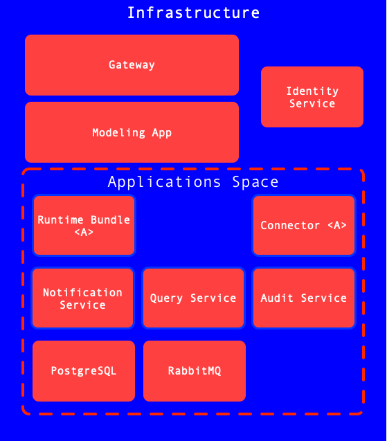

# Getting Started - Activiti Cloud

## Getting Started with Activiti Cloud

Activiti Cloud is a set of Cloud Native components designed from the ground up to work in distributed environments. We have chosen Kubernetes as our main deployment infrastructure and we are using Spring Cloud / Spring Boot along with Docker for containerization of these components.

We have gone through a very valuable journey, meeting very passionate developers, communities and existing and potential customers who are looking to leverage these technologies (and business automation solutions) to reduce time to market and improve business agility in the Cloud. We have also contributed with these communities, making sure that the Open Source projects that we consume get back our valuable feedback and contributions.

Activiti Cloud includes 5 foundational building blocks:

* Activiti Cloud Runtime Bundle
* Activiti Cloud Query
* Activiti Cloud Audit
* Activiti Cloud Connectors
* Activiti Cloud Notifications Service (GraphQL)

These building blocks are Spring Boot Starters that can be attached to any Spring Boot (2.x) application. These building blocks are enhanced with Spring Cloud functionalities which provide the Cloud Native capabilities.

By using these components you can create Activiti Cloud applications that:

* can be scaled independently based on demand
* can be managed in completely isolated cycles
* can be upgraded and maintained independently
* can provide domain specific features using the right tool for the job

On this tutorial, we wanted to show how to get started by deploying an example set of these building blocks in Kubernetes. We strongly recommend having a real Kubernetes Cluster such as GKE, PKS or EKS. We have tested the content of this blog post in AWS (Using Kops, PKS, GKE and also with Jenkins X)

Let’s get started with Kubernetes, HELM, and Activiti Cloud.

## Prerequisites

The quickest and easiest way to deploy things to Kubernetes is by using HELM charts. HELM, as described in the official documentation, is: “_a tool that streamlines installing and managing Kubernetes applications. Think of it like apt/yum/homebrew for Kubernetes_.”

As part of Activiti Cloud, we have created a set of hierarchical HELM charts that can be used to deploy several components, some related to infrastructure (such as SSO and Gateway) and some Application specific components like Runtime Bundle, Audit Service, Query Service and a Cloud Connector.

In this quick-start, we will be looking more specifically at: [https://github.com/Activiti/activiti-cloud-full-chart/tree/master/charts/activiti-cloud-full-example](https://github.com/Activiti/activiti-cloud-full-chart/tree/master/charts/activiti-cloud-full-example)

and Activiti Cloud Query [https://github.com/Activiti/activiti-cloud-query/tree/master/charts/activiti-cloud-query](https://github.com/Activiti/activiti-cloud-query/tree/master/charts/activiti-cloud-query)

Parent chart with common parts located at [https://github.com/Activiti/activiti-cloud-common-chart/tree/master/charts/common](https://github.com/Activiti/activiti-cloud-common-chart/tree/master/charts/common)

All chart archives are moved to [https://github.com/Activiti/activiti-cloud-helm-charts](https://github.com/Activiti/activiti-cloud-helm-charts)\
Common chart is a base chart for all charts now located at [https://github.com/Activiti/activiti-cloud-common-chart](https://github.com/Activiti/activiti-cloud-common-chart). Charts for components located at component folders like:

Runtime - [https://github.com/Activiti/example-runtime-bundle/tree/master/charts/runtime-bundle](https://github.com/Activiti/example-runtime-bundle/tree/master/charts/runtime-bundle) Example cloud connector -[https://github.com/Activiti/example-cloud-connector/tree/master/charts/activiti-cloud-connector](https://github.com/Activiti/example-cloud-connector/tree/master/charts/activiti-cloud-connector)

Audit - [https://github.com/Activiti/activiti-cloud-audit/tree/master/charts/activiti-cloud-audit](https://github.com/Activiti/activiti-cloud-audit/tree/master/charts/activiti-cloud-audit)

Query - [https://github.com/Activiti/activiti-cloud-query/tree/master/charts/activiti-cloud-query](https://github.com/Activiti/activiti-cloud-query/tree/master/charts/activiti-cloud-query)

This “Activiti Cloud Full Example” deploys the following components:



One important thing to notice is that each of the Activiti Cloud components can be used independently. This example is intended to show a large-scale deployment scenario. You can start small with a Runtime Bundle (which provides the process and task runtimes), but if you want to scale things up you need to know what you are aiming for, and this charts shows you exactly that.

### Install Kubectl and HELM

* Kubectl : [https://kubernetes.io/docs/tasks/tools/install-kubectl/](https://kubernetes.io/docs/tasks/tools/install-kubectl/)
* HELM: [https://github.com/helm/helm/#install](https://github.com/helm/helm/#install) . Please use helm version 3.

In the next section, we show you how to create a Kubernetes cluster using Amazon Web Services EKS or Google Cloud Platform GKE. We let you decide which cloud platform best suits you. You can also deploy the Activiti Cloud full example on you local machine using for example Docker Desktop. We recommend using a cloud infrastructure for a faster and smoother experience but if you need a local install you can check [our blog post series here](https://community.alfresco.com/community/bpm/blog/2018/12/10/getting-started-with-activiti-7-beta#jive\_content\_id\_Deploying\_and\_Running\_a\_Business\_Process).

## Steps 1 and 2: Create a K8 cluster and configure it

### [Option A: Using Amazon EKS](amazon-eks.md)

### [Option B: Using Google Cloud - GKE](google-cloud-gke.md)

## Step 3: Deploy Activiti Cloud Full Example

The first step is to register the Activiti Cloud HELM charts into HELM running the following commands:

```bash
helm repo add activiti-cloud-helm-charts https://activiti.github.io/activiti-cloud-helm-charts/
```

```bash
helm repo update
```

The Activiti Cloud Full Example Chart can be customized to turn on and off different features, but there is one mandatory parameter that needs to be provided which is the external domain name that is going to be used by this installation:

### 1-a) Configure your deployment for AWS


_For this step, you need a public domain name. If you don't have one, use Route 53 to register a new public domain name._


Go to the AWS Management Console and open the Route 53 console. Go to _Hosted zones_ and select a public Hosted Zones and create a new Record Set. Name it using “\*” character in order to create a wildcard. In the Alias Target, select the DNS name of the Ingress controller (ELB) that we deployed earlier.


Use "**your-public-domain**" to deploy Activiti Helm chart in the next section. In our case: **raphaelallegre.com**

### 1-b) Configure your deployment for **GCP**

With GCP, use "**\<EXTERNAL-IP>.nip.io**" to deploy Activiti Helm chart. In our case: **35.194.42.164.nip.io**

### 2) Deploy the Helm chart

Once you have resolved you domain name, install Helm chart by running the Helm install command using your public domain name to set the `global.gateway.domain` key. In our case replace the string “**REPLACEME**” with the domain from previous step.

```bash
helm install --name example activiti-cloud-helm-charts/activiti-cloud-full-example --version 7.3.0 --set global.gateway.domain=REPLACEME --set global.keycloak.clientSecret=$(uuidgen)
```

In our case for AWS, we use:

```bash
global.gateway.domain=raphaelallegre.com
```

In our case for GCP, we use:

```bash
global.gateway.domain=35.194.42.164.nip.io
```

Here is the example result for AWS:

```
NOTES:
               _   _       _ _   _    _____ _                 _ 
     /\       | | (_)     (_) | (_)  / ____| |               | |
    /  \   ___| |_ ___   ___| |_ _  | |    | | ___  _   _  __| |
   / /\ \ / __| __| \ \ / / | __| | | |    | |/ _ \| | | |/ _` |
  / ____ \ (__| |_| |\ V /| | |_| | | |____| | (_) | |_| | (_| |
 /_/    \_\___|\__|_| \_/ |_|\__|_|  \_____|_|\___/ \__,_|\__,_|
 Version: 7.1.0-SNAPSHOT

Thank you for installing activiti-cloud-full-example-7.1.0-M4

Your release is named example.

To learn more about the release, try:

  $ helm status example
  $ helm get example

Get the application URLs:

Activiti Gateway         : http://gateway.default.alfrescodemo.co.uk/
Activiti Identity        : http://identity.default.alfrescodemo.co.uk/auth
Activiti Modeler         : http://gateway.default.alfrescodemo.co.uk/modeling
Activiti Runtime Bundle  : http://gateway.default.alfrescodemo.co.uk/rb
Activiti Cloud Connector : http://gateway.default.alfrescodemo.co.uk/example-cloud-connector
Activiti Query           : http://gateway.default.alfrescodemo.co.uk/query
Activiti Audit           : http://gateway.default.alfrescodemo.co.uk/audit
Notifications GraphiQL   : http://gateway.default.alfrescodemo.co.uk/notifications/graphiql
Notifications WebSockets : http://gateway.default.alfrescodemo.co.uk/notifications/ws/graphql
Notifications Graphql    : http://gateway.default.alfrescodemo.co.uk/notifications/graphql

To see deployment status, try:

  $ kubectl get pods -n default
raphaels-mbp-1:development raphaelallegre$ 
```

Below is the BPMN 2 modelling application. Default user: modeler/password.

 (1).png>)

For more information about the BPMN modelling application, please check the [following blog post](https://community.alfresco.com/community/bpm/blog/2018/12/10/activiti-7-beta-using-the-modeler-to-design-business-processes).

## Step 4: Use the deployed services

If you don't have it installed already, install the [Postman client](https://www.getpostman.com) on your machine.

Then, download the Activiti Cloud Postman collection from the [Activiti Cloud Examples repository](https://github.com/Activiti/activiti-cloud-examples) using the command:

```bash
curl -o Activiti_v7_REST_API.postman_collection.json https://raw.githubusercontent.com/Activiti/activiti-cloud-examples/develop/Activiti%20v7%20REST%20API.postman_collection.json
```

Import the collection in Postman using _**Import**_ button.

Before calling any service you will need to create a new Environment in Postman. You can do that by going to the Manage Environment icon (cog)


Then “Add” a new environment and add a name to it. Now you need to configure the variables for the environment: “gateway”, “idm” and “realm”

For gateway you need to copy the url associated with your Ingress, the same for idm which is SSO and IDM using Keycloak. For the realm enter “activiti”:

.png>)

Click Save or Update and then you are ready to start using that Environment. Make sure that you select the environment in the dropdown on the right:


As shown in the previous screenshot, if you go to the _**keycloak**_ directory and select the “_**getKeycloakToken testuser**_” you will get the token which will be used to authenticate further requests. Notice that this token is time sensitive and it will be automatically invalidated so you might need to get it again if you start getting unauthorized errors.

Once you get the token for a user, you can interact with all the user endpoints. For example, you can create a request to see which Process Definitions are deployed inside our Example Runtime Bundle:


Now you can also start a new Process Instance from our SimpleProcess:


```bash
{
  "processDefinitionKey": "SimpleProcess",
  "variables": {
    "firstName": "salaboy",
    "lastName": "salaboy",
    "age": 99
  },
  "payloadType":"StartProcessPayload"
}
```

You can check that the audit service contains the events associated to the just started process instance.


And that the query service already contains information about the process execution:


You are now ready to start consuming these services to automate your own business processes.

Finally, you can access to all services Swagger documentation by pointing your browser to:

* [http://activiti-cloud-gateway.EXTERNAL-IP.nip.io/rb/swagger-ui/index.html](http://activiti-cloud-gateway.external-ip.nip.io/rb/swagger-ui/index.html)
* [http://activiti-cloud-gateway.EXTERNAL-IP.nip.io/audit/swagger-ui/index.html](http://activiti-cloud-gateway.external-ip.nip.io/audit/swagger-ui/index.html)
* [http://activiti-cloud-gateway.EXTERNAL-IP.nip.io/query/swagger-ui/index.html](http://activiti-cloud-gateway.external-ip.nip.io/query/swagger-ui/index.html)


All our services are using SpringFox to generate this documentation and provide a UI for it.

## Summary

In this tutorial we have seen how to create a Kubernetes cluster (using GKE or EKS) and deploy an Activiti Cloud application using the Activiti Cloud HELM charts. If you are not familiar with Kubernetes, Docker and GKE or AWS this might look like a lot of new information and it is our mission to simplify all the steps covered in these getting started guides. For that reason, we recommend you checkout the Jenkins X project, which greatly simplifies the first two sections about creating clusters and configuring the basic infrastructure for your projects.

As part of the Activiti Cloud initiative we are making sure that we follow best practices coming from the Kubernetes, Docker and Spring Cloud communities and we are contributing back with fixes and feedback to make this technology stack the best for Cloud Native applications.

If you have questions or feedback about this tutorial, feel free to get in touch with the Activiti team via the dedicated [Gitter](https://gitter.im/Activiti/Activiti7) [channel](https://gitter.im/Activiti/Activiti7).
