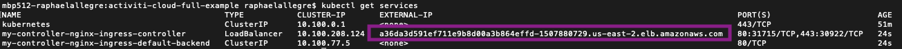

# Amazon EKS

## Step 1: Create a Kubernetes cluster

### 1\) Install aws-iam-authenticator for Amazon EKS

Amazon EKS clusters requires the [AWS IAM Authenticator for Kubernetes](https://github.com/kubernetes-sigs/aws-iam-authenticator) to allow IAM authentication for your Kubernetes cluster. Use go get to install the aws-iam-authenticator binary:

```bash
go get -u -v github.com/kubernetes-sigs/aws-iam-authenticator/cmd/aws-iam-authenticator
```


_Note: use Go 1.7 or greater._


Add $HOME/go/bin to your PATH environment variable:

* For Bash shells on macOS:

```bash
export PATH=$HOME/go/bin:$PATH && echo 'export PATH=$HOME/go/bin:$PATH' >> ~/.bash_profile
```

* For Bash shells on Linux:

```bash
 export PATH=$HOME/go/bin:$PATH && echo 'export PATH=$HOME/go/bin:$PATH' >> ~/.bashrc
```

Run this command to test that the aws-iam-authenticator binary works:

```bash
aws-iam-authenticator help
```

### **2/ Install AWS CLI**

To install the aws cli, check the user guide: [https://docs.aws.amazon.com/cli/latest/userguide/cli-chap-install.html](https://docs.aws.amazon.com/cli/latest/userguide/cli-chap-install.html)

Once installed, check your AWS CLI version with the following command:

```bash
aws --version
```

Example output:

```text
aws-cli/1.16.87 Python/3.7.2 Darwin/18.2.0 botocore/1.12.77
```


_Note: your system's Python version must be Python 3, or Python 2.7.9 or greater. Otherwise, you receive hostname doesn't match errors with AWS CLI calls to Amazon EKS._


Configure your AWS CLI to interact with your AWS account using the command below:

```text
aws configure
AWS Access Key ID [None]: <your-access-key-ID>
AWS Secret Access Key [None]:<your-secet-access-key>
Default region name [None]: <your-region>
Default output format [None]: json
```

### 3/ Create an EKS cluster

To simplify the creation of our cluster on EKS, we are using a simple CLI tool named eksctl available here: [https://github.com/weaveworks/eksctl](https://github.com/weaveworks/eksctl).

To create a basic EKS cluster with a given name and region, run:

```bash
eksctl create cluster --name=<name> --region=<region>
```

A cluster will be created with default parameters:

* exciting auto-generated name, e.g. "fabulous-mushroom-1527688624"
* 2x `m5.large` nodes \(this instance type suits most common use-cases, and is good value for money\)
* use official AWS EKS AMI
* `us-west-2` region
* dedicated VPC \(check your quotas\)
* using static AMI resolver

Check the [eksctl doc](https://github.com/weaveworks/eksctl) if you want to change default parameters.

Go to your AWS console and check the details about your EKS cluster.



_Note: to delete your EKS cluster run the command:_

```bash
eksctl delete cluster --name=<name> --region=<region>
```

_Make sure it deleted all the associated EC2 resources avoiding you any bad surprises when checking your bill_ 😀


### **4\) Configure Kubectl for Amazon EKS**

Use the AWS CLI update-kubeconfig command to create or update your kubeconfig for your cluster.

```bash
aws eks update-kubeconfig --name <cluster_name>
```

Test your configuration:

```bash
kubectl get svc
```

## **Step 2: Configure HELM and install NGINX Ingress**

Let's now configure HELM to work in the Cluster. We first need to give HELM permissions to deploy things into the cluster. Download the file below:



Run the following commands in your terminal:

```bash
kubectl apply -f helm-service-account-role.yaml
```

```bash
helm init --service-account helm --upgrade
```

In order to be able to expose our services to be accessed from outside the cluster, we need to set up an Ingress Controller, which will automatically create routes to the internal services that we want to expose. To install the NGINX Ingress controller, run the following command:

```bash
helm install stable/nginx-ingress --version 1.1.2
```

Now that NGINX Ingress Controller is being deployed, we need to wait for it to expose itself using a Public IP. We need this Public IP to interact with our services from outside the cluster. You can find this IP by running the following command:

```bash
kubectl get services
```

Example output:



## Step 3: Deploy Activiti Cloud Full Example

The first step is to register the Activiti Cloud HELM charts into HELM running the following commands:

```bash
helm repo add activiti-cloud-charts https://activiti.github.io/activiti-cloud-charts/
```

```bash
helm repo update
```

The Activiti Cloud Full Example Chart can be customized to turn on and off different features, but there is one mandatory parameter that needs to be provided which is the external domain name that is going to be used by this installation:

### 1\) Configure your deployment


_For this step, you need a public domain name. If you don't have one, use Route 53 to register a new public domain name._


Go to the AWS Management Console and open the Route 53 console. Go to _Hosted zones_ and select a public Hosted Zones and create a new Record Set. Name it using “\*” character in order to create a wildcard. In the Alias Target, select the DNS name of the Ingress controller \(ELB\) that we deployed earlier.


Use "**your-public-domain**" to deploy Activiti Helm chart in the next section. In our case: **raphaelallegre.com**

### 2\) Deploy the Helm chart

Once you have resolved you domain name, install Helm chart by running the Helm install command using your public domain name to set the `global.gateway.domain` key. In our case replace the string “**REPLACEME**” with the domain from previous step.

```bash
helm install --name example activiti-cloud-charts/activiti-cloud-full-example --set global.gateway.domain=REPLACEME
```

In our case, we use:

```bash
global.gateway.domain=raphaelallegre.com
```

Here is the example result:

```text
NOTES:
               _   _       _ _   _    _____ _                 _
     /\       | | (_)     (_) | (_)  / ____| |               | |
    /  \   ___| |_ ___   ___| |_ _  | |    | | ___  _   _  __| |
   / /\ \ / __| __| \ \ / / | __| | | |    | |/ _ \| | | |/ _` |
  / ____ \ (__| |_| |\ V /| | |_| | | |____| | (_) | |_| | (_| |
 /_/    \_\___|\__|_| \_/ |_|\__|_|  \_____|_|\___/ \__,_|\__,_|
 Version: 7.0.0.GA

Thank you for installing activiti-cloud-full-example-1.1.1

Your release is named example.

To learn more about the release, try:

  $ helm status example
  $ helm get example

Get the application URLs:

Activiti Keycloak : http://activiti-cloud-gateway.default.35.194.42.164.nip.io/auth
Activiti Gateway  : http://activiti-cloud-gateway.default.35.194.42.164.nip.io/
Activiti Modeler  : http://activiti-cloud-gateway.default.35.194.42.164.nip.io/activiti-cloud-modeling
Activiti GraphiQL : http://activiti-cloud-gateway.default.35.194.42.164.nip.io/graphiql

To see deployment status, try:

  $ kubectl get pods -n default
```

Below is the BPMN 2 modelling application. Default user: modeler/password.


For more information about the BPMN modelling application, please check the [following blog post](https://community.alfresco.com/community/bpm/blog/2018/12/10/activiti-7-beta-using-the-modeler-to-design-business-processes).

