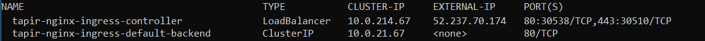

# Azure AKS

## Step 1: Create a Kubernetes cluster


### **1/ Kubernetes cluster**

Go to your azure portal and select the option Kubernetes Service


Select or create a new subscription, resource group, region and kubernetes version.
Enter the name of cluster and DNS prefix.



Click the "Review + create"


_Note: the defaults option have not been changed.


### **2/ Install Azure CLI**

To install the azure cli, check the site:
https://docs.microsoft.com/pt-br/cli/azure/install-azure-cli?view=azure-cli-latest

Log in and follow the installation until the end. (Next > next and next)


_Note: At the end, configure your Environment Variables:
1. Run "set PATH=%PATH%;C:\Users\coelhom\.azure-kubectl" or "$env:path += 'C:\Users\coelhom\.azure-kubectl'" for PowerShell. This is good for the current command session.
OR
2. Update system PATH environment variable by following "Control Panel->System->Advanced->Environment Variables", and re-open the command window. You only need to do it once


Once installed, check your Azure CLI version with the following command:

```bash
az --version
```

Get your credentials:

```bash
az aks get-credentials --resource-group myResourceGroup --name myAKSCluster
```

Open the page of kubernetes:
```bash
az aks browse --resource-group myResourceGroup --name myAKSCluster
```
## **Step 2: Configure HELM and install NGINX Ingress**

Let's now configure HELM to work in the Cluster. We first need to give HELM permissions to deploy things into the cluster. Download the file below:



Run the following commands in your terminal:

```bash
kubectl apply -f helm-service-account-role.yaml
```

```bash
helm init --service-account helm --upgrade
```

In order to be able to expose our services to be accessed from outside the cluster, we need to set up an Ingress Controller, which will automatically create routes to the internal services that we want to expose. To install the NGINX Ingress controller, run the following command:

```bash
helm install stable/nginx-ingress --version 1.1.2
```

Now that NGINX Ingress Controller is being deployed, we need to wait for it to expose itself using a Public IP. We need this Public IP to interact with our services from outside the cluster. You can find this IP by running the following command:

```bash
kubectl get svc
```
Example output with Azure deployment:



## [Step 3: Deploy Activiti Cloud Full Example](./#step-3-deploy-activiti-cloud-full-example)
