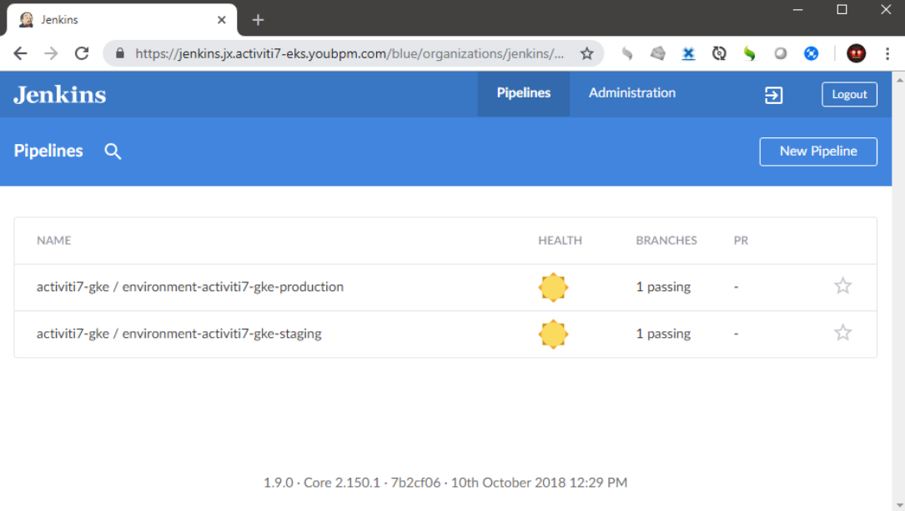
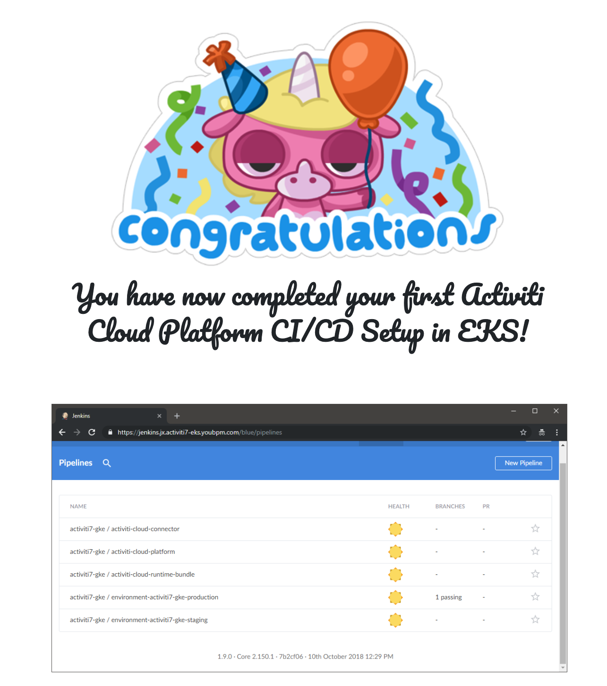

# Google GKE

## Setup Overview

We will create a GKE cluster deployed in GCP and exposed to the outside world using Network Load Balancer and Cloud DNS domain mapping.

Jenkins-X platform is then deployed and configured with Git provider to trigger Kubernetes-based pipelines which produce Docker images pushed into private Google Container Registry \(GCR\). Jenkins-X will also deploy our Activiti Cloud Helm chart into Namespace of a GKE cluster and expose it via Ingress to the outside world.


The diagram above uses Kubernetes Deployment Language: [https://github.com/raffaelespazzoli/kdl](https://github.com/raffaelespazzoli/kdl)

All of the persistence volume claims of Activiti Cloud infrastructure and applications will be handled by Google Storage services using Google PV Storage, which will be used to provision Kubernetes persistent volumes for Audit, Query and Runtime Bundle using PostgreSQL database service.

## The Walkthrough

### Step 1. Installing Jenkins-X Jx Cli

We recommend to use Cloud Shell, if this is your first time installing Activiti Cloud in GKE. You may also use Bash terminal locally, if you know what you are doing.

The first thing we need to do is install the jx binary and add it to your PATH. You will need to [get the jx command line tool](https://jenkins-x.io/getting-started/install/) installed locally on your machine for your OS \(Linux or MacOS recommended\). You should use Linux OS to install Jx in Cloud Shell.

After successful installation of jx client you should now be able to display the jx client version by executing the following command:

```text
$ jx version
NAME               VERSION
Jx                 2.0.323
```

#### Required Dependencies

JX will attempt to locate any required dependencies. If JX discovers that some dependencies are missing it will prompt to install them for you in the ~/.jx/bin folder. It is recommended that you allow jx to install any missing dependencies. You may also choose to install required dependencies for your OS manually:

* Kubernetes Helm \([https://helm.sh](https://helm.sh)\)
* Google Cloud SDK \([https://cloud.google.com/sdk/install](https://cloud.google.com/sdk/install)\)
* Kubectl \([https://kubernetes.io/docs/tasks/tools/install-kubectl/](https://kubernetes.io/docs/tasks/tools/install-kubectl/)\)
* Git Client \([https://git-scm.com/downloads](https://git-scm.com/downloads)\)

In order to setup Jenkins-X in Kubernetes with Github provider for CI/CD GitOps, you will need to create a user account on Github to host Jenkins-X environment repositories.

### Step 2. Creating the GKE Cluster

Before you begin, please, follow the steps to create new Google Cloud Project with private Google Container Registry that runs on Google Cloud Platform.

1. In the GCP Console, go to the Manage resources page and select or create a project. Note: If you don't plan to keep the resources you create in this tutorial, create a new project instead of selecting an existing project. After you finish, you can delete the project, removing all resources associated with the project and tutorial.
2. Make sure that billing is enabled for your project.
3. Enable Cloud Build API for your project: [https://console.cloud.google.com/flows/enableapi?apiid=cloudbuild.googleapis.com](https://console.cloud.google.com/flows/enableapi?apiid=cloudbuild.googleapis.com)
4. Enable Container Registry API for your project: [https://console.cloud.google.com/flows/enableapi?apiid=containerregistry.googleapis.com](https://console.cloud.google.com/flows/enableapi?apiid=containerregistry.googleapis.com)
5. Enable Container Analysis API for your project: [https://console.cloud.google.com/flows/enableapi?apiid=containeranalysis.googleapis.com](https://console.cloud.google.com/flows/enableapi?apiid=containeranalysis.googleapis.com)

Then, open Cloud Shell >\_ or your Bash terminal and set the following environment variables:

```text
export CLUSTER_NAME=activiti7-gke
export PROJECT_ID=project-XYZ
```

Then, use the following command to find out zones available for your project and choose one of the zones close to you:

```text
$ gcloud compute zones list
```

Then, set the ZONE variable in your terminal using the zone near you, i.e.

```text
export ZONE=us-west1-a
```

If you are using Cloud Shell, then set the following environment variable:

```text
export SKIP_LOGIN=--skip-login
```

#### Create Your Cluster

To create the cluster, open Google Cloud Shell for your project and run the following Jx command to guide you through creating a cluster on GKE:

Upgrade the jx if needed:

```text
$ jx version
NAME               VERSION
jx                 2.0.323
jenkins x platform 0.0.3368
Kubernetes cluster v1.11.6-gke.2
kubectl            v1.13.3
helm client        v2.12.2+g7d2b0c7
helm server        v2.12.2+g7d2b0c7
git                git version 2.18.0.windows.1
Operating System   Windows 10 Pro 1809 build 17763

A new jx version is available: 1.3.933
? Would you like to upgrade to the new jx version? [? for help] (Y/n) Yes
```

_Note_: Jx cli simply wraps glcoud cli to create cluster using Google SDK api. If you know what you are doing, you may choose to create cluster manually based on your availability zone requirements or api oauth scopes using gcloud command or Google Console instead of jx cli. If you do create cluster manually, please, enable the following Cloud Apis for the project: **"container", "compute", "cloudbuild", "containerregistry", "containeranalysis"** to utilise Container Registry, Cloud Build and Container Analysis and use the following oauth scopes for gcloud command `--scopes=` options to allow API access to storage based services using cluster service account:

```text
"https://www.googleapis.com/auth/cloud-platform",
"https://www.googleapis.com/auth/compute",
"https://www.googleapis.com/auth/devstorage.full_control",
"https://www.googleapis.com/auth/service.management",
"https://www.googleapis.com/auth/servicecontrol",
"https://www.googleapis.com/auth/logging.write",
"https://www.googleapis.com/auth/monitoring"
```

If you have the cluster already with these scopes enabled, connect to it in Cloud Shell or Bash console and proceed to **Install Jenkins-X Platform** section in this document.

```bash
jx create cluster gke \
  --project-id=$PROJECT_ID \
  --cluster-name=$CLUSTER_NAME \
  --machine-type='n1-standard-4' \
  --min-num-nodes='2' \
  --skip-installation \
  --enhanced-apis \
  --enhanced-scopes \
  --kaniko=false \
  --zone=$ZONE \
  --advanced-mode \
  $SKIP_LOGIN
```

JX will then prompt you for the basic configuration options for your cluster, such as:

```text
Open Browser to authenticate and authorize Google Cloud SDK API (skipped in Cloud Shell)
? Maximum Node Count: 5
? Would you like use preemptible VMs? No / Yes for testing only 
? Would you like enable Kaniko? No


Creating cluster...
Gke cluster created. Skipping Jenkins X installation.
```

**Install Jenkins-X Platform**

We are now ready to install Jenkins-X platform into the cluster with Github provider. Run the following command:

_Note_: To setup and use other than Github Git provider see: [https://jenkins-x.io/developing/git/](https://jenkins-x.io/developing/git/)

```bash
jx install --provider=gke \
    --docker-registry=gcr.io/$PROJECT_ID \
    --no-default-environments \
    --static-jenkins \
    --no-tiller=false \
    --advanced-mode
```

JX will then prompt you for the basic configuration options for your installation, such as:

```text
? No existing ingress controller found in kube-system, install one: Yes
? Domain Configuration: Use the default domain name i.e. X.X.X.X.nip.io
```

**GitHub Connectivitiy**

If this is the first time you have run jx in the terminal, jx will prompt you for a github username & api token. If you already have one, simply enter the values when prompted. If you don't have an api token, click on the link provided to generate one and enter the token value into the prompt:

```text
? GitHub username: username


To be able to create a repository on GitHub we need an API Token
Please click this URL https://github.com/settings/tokens/new?scopes=repo,read:user,read:org,user:email,write:repo_hook,delete_repo

Then COPY the token and enter it in into the form below:
? API Token: ****************************************
? Do you wish to use Username as the pipelines Git user for GitHub server: Yes
? A local Jenkins X cloud environments repository already exists, recreate? Yes
```

**Jenkins Connectivity**

Next, jx will attempt to configure Jenkins connectivity. This should be done automatically, but sometimes Jenkins is not able to start in time. In this instance, you will be asked to login to Jenkins using the admin user. The password for the admin user will be displayed in the console. At this point, follow the instructions to add the Jenkins API token.

```text
? Select Jenkins installation type: Static Master Jenkins
? Pick workload build pack: Kubernetes Automated CI+CD with GitOps Promotion
? Select the organization where you want to create the environment repository: username
```

**Setup Confirmation**

```text
Jenkins X installation completed successfully                                   

        ********************************************************                          

             NOTE: Your admin password is: XXXXXXXXXXXXXXXXXXXX                          

        ********************************************************                          

Your Kubernetes context is now set to the namespace: jx                                   
To switch back to your original namespace use: jx namespace default                       
Or to use this context/namespace in just one terminal use: jx shell                       
For help on switching contexts see: https://jenkins-x.io/developing/kube-context/         

To import existing projects into Jenkins:       jx import                                 
To create a new Spring Boot microservice:       jx create spring -d web -d actuator       
To create a new microservice from a quickstart: jx create quickstart
```

The URL to access Jenkins will be printed in the output of the console together with the random admin password auto-generated by jx We now can use Jenkins credentials to log into our Jenkins server and see that Jenkins has successfully installed.

_Note_: after you have installed Jenkins-X, you may want to configure Jenkins-X to make all new repositories private by default with the following command:

```text
jx edit gitprivate
```

To open Jenkins UI in the browser, run the following command to get Jenkins UI link. You may want to save it for future use:

```text
jx console
```


In the Jenkins UI, you can confirm that Jenkins X has successfully installed Jenkins instance:


 Close the Jenkins UI tab and go back to your shell.

### Step 3. Create Activiti Cloud GitOps Environments

We will now proceed to provision two environments for deploying Activiti Cloud Platform: a staging environment with Auto promotion and a production environment with Manual promotion strategy.

#### Get Jx Cluster Domain

Set the following environment variables:

```bash
export CLUSTER_DOMAIN=$(kubectl get cm ingress-config -o=go-template --template='{{.data.domain}}' -n jx) && echo $CLUSTER_DOMAIN
export ENV_PREFIX=$CLUSTER_NAME && echo $ENV_PREFIX
```

#### Create Activiti Cloud DevOps Environment

Run this command to configure environments using domain name of the cluster with the Activti Cloud Environment Git repository used as the fork when creating new GitOps environment Git repo and custom environment repo prefix. Your Environment Git repo will be of the form 'environment-$prefix-$envName'

```bash
export ENV_REPO=https://github.com/activiti/activiti-cloud-environments.git
```

Select default options when running following commands to create Activiti Cloud Platform GitOps environments;

```bash
jx create env --domain $CLUSTER_DOMAIN \
    --fork-git-repo=$ENV_REPO \
    --prefix=$ENV_PREFIX \
    --name=staging \
    --namespace=staging \
    --git-private=true \
    --label=Staging \
    --promotion=Auto \
    --batch-mode
```

```bash
jx create env --domain $CLUSTER_DOMAIN \
    --fork-git-repo=$ENV_REPO \
    --prefix=$ENV_PREFIX \
    --name=production \
    --namespace=production \
    --git-private=true \
    --label=Production \
    --promotion=Manual \
    --batch-mode    
```

After Jx created new environments, run `jx console` command to open Jenkins UI, where you can confirm that Jenkins X has successfully provisioned two environments for us: a staging environment and a production environment:

```bash
jx console
```



You can also navigate to GitHub and see that Jenkins X provisioned the projects representing the environments’ Helm chart definitions as just built by Jenkins.


#### Configure Activiti Cloud Environments Domain Name

After Jx creates the environment in your Git repository, open your repo, then edit env/values.yaml file to set the value of global.gateway.domain key from expose.config.domain value

```text
expose:
  config:
    domain: X.X.X.X.nip.io # <==== Use this value to set global.gateway.domain

global:
  gateway:
    # Set value from expose.config.domain key, i.e. 1.2.3.4.nip.io
    domain: CHANGEME
```

Click to Commit the change. This should trigger Jenkins pipeline to rebuild and update the environments Helm chart configurations.

### Step 4. Create Activiti Cloud Platform CI/CD Quickstarts


**Create Activiti Cloud Quickstart Location in Jx Team Environment**

We will need to create Activiti Jx Quickstart Location to use Activiti Quickstart templates published in Activiti Github [https://github.com/Activiti](https://github.com/Activiti) organization repository:

Run this command to add Activiti Quickstart location for your team:

```bash
jx create quickstartlocation --owner activiti
```

To get the list of registered quickstart locations run command:

```bash
$ jx get quickstartlocations
GIT SERVER         KIND   OWNER                 INCLUDES EXCLUDES
https://github.com github jenkins-x-quickstarts *        WIP-*
https://github.com github activiti              *        WIP-*
```

#### Setup Activiti Cloud Platform in your Git repository

Run the following command to create your first Activiti Cloud Platform Git repository:

```bash
jx create quickstart --owner activiti \
    --filter=activiti-cloud-platform-quickstart \
    --project-name=activiti-cloud-application \
    --batch-mode
```

Note that there will be some warning type messages which is normal jx logging so not to worry.

After that run the following command in another terminal to monitor pipeline activities:

```bash
jx get activity -w
```

Then, after ~4-5 minutes you should see your Activiti Cloud Platform deployed into staging namespace in K8s cluster:

```bash
watch kubectl get pods -n staging
```

You can now find out ingress hosts exposing Activiti Cloud Platform Services:

```text
$ kubectl get ing -n staging

NAME                                      HOSTS                                 ADDRESS       PORTS   AGE
jx-activiti-cloud-gateway                 gateway.staging.X.X.X.X.nip.io    35.230.12.0   80      18m
jx-activiti-cloud-notifications-graphql   gateway.staging.X.X.X.X.nip.io    35.230.12.0   80      18m
jx-keycloak                               identity.staging.X.X.X.X.nip.io   35.230.12.0   80      18m

Keycloak (admin/admin): 
http://identity.staging.X.X.X.X.nip.io/auth

Modeler (modeler/password): 
http://gateway.staging.X.X.X.X.nip.io/modeling 

Notifications GraphiQL (testadmin/password): 
http://gateway.staging.X.X.X.X.nip.io/notifications/graphiql
```

#### Setup Activiti Cloud Connector in your Git Repository

Run the following command to create your first connector project Git repository:

```bash
jx create quickstart --owner activiti \
    --filter activiti-cloud-connector-quickstart \
    --project-name=activiti-my-connector \
    --batch-mode
```

#### Setup Activiti Cloud Runtime Bundle in your Git repository

Run the following command to create your first runtime bundle project Git repository:

```bash
jx create quickstart --owner activiti \
    --filter activiti-cloud-runtime-bundle-quickstart \
    --project-name=activiti-my-rb \
    --batch-mode
```

Then, after ~4-5 minutes you should see your Connector and Runtime Bundle deployed into staging environment:

```bash
watch kubectl get pods -n staging
```




#### Open Activiti Cloud Modeler

[http://gateway.staging.X.X.X.X.nip.io/modeling](http://activiti-cloud-gateway.jx-staging.1,2,3,4.nip.io/activiti-cloud-modeling)

Here instead of X.X.X.X.nip.io use the earlier $CLUSTER\_DOMAIN environment variable, i.e. 

```bash
echo gateway.$CLUSTER_DOMAIN/modeling
```

Login into using credentials: modeler/password


