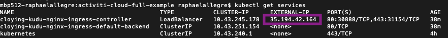

# Google Cloud GKE

## Step 1: Create a Kubernetes cluster

### 1\) Create a Google Cloud Platform \(GCP\) account

As a free option, GCP offers a $300 free credit: [https://console.cloud.google.com/freetrial](https://console.cloud.google.com/freetrial)

### 2\) Install CLI

Install the SDK CLI tool: [https://cloud.google.com/sdk/install](https://cloud.google.com/sdk/install)

### 3\) Create a Kubernetes cluster \(GKE\)

To create a new Kubernetes cluster, go to your GCP Console Home Page \([https://console.cloud.google.com](https://console.cloud.google.com/)\) and select _**Kubernetes Engine / Clusters.**_


Then select the CREATE CLUSTER button  from the top menu.

Enter the Cluster Name, select the Zone based on your location and I’ve selected 2 vCPUs and left the Size to the default value \(3\).


Once the cluster is created click on the Connect Button on the right hand side of the table:


This will open a popup with a command to connect to the cluster. Copy it to your clipboard, open a terminal and paste the command into your terminal.


_Note: if you are working with an existing cluster, you will need to check if you have an Ingress Controller already installed, you can skip the NGINX Ingress installation \(step 2\) if that is the case._


## **Step 2: Configure HELM and install NGINX Ingress**

Let's now configure HELM to work in the Cluster. We first need to give HELM permissions to deploy things into the cluster. Download the file below:



Run the following commands in your terminal:

```bash
kubectl apply -f helm-service-account-role.yaml
```

```bash
helm init --service-account helm --upgrade
```

In order to be able to expose our services to be accessed from outside the cluster, we need to set up an Ingress Controller, which will automatically create routes to the internal services that we want to expose. To install the NGINX Ingress controller, run the following command:

```bash
helm install stable/nginx-ingress --version 1.1.2
```

Now that NGINX Ingress Controller is being deployed, we need to wait for it to expose itself using a Public IP. We need this Public IP to interact with our services from outside the cluster. You can find this IP by running the following command:

```bash
kubectl get services
```

Example output with GCP deployment:



## Step 3: Deploy Activiti Cloud Full Example

The first step is to register the Activiti Cloud HELM charts into HELM running the following commands:

```bash
helm repo add activiti-cloud-charts https://activiti.github.io/activiti-cloud-charts/
```

```bash
helm repo update
```

The Activiti Cloud Full Example Chart can be customized to turn on and off different features, but there is one mandatory parameter that needs to be provided which is the external domain name that is going to be used by this installation:

### 1\) Configure your deployment

With GCP, use "**&lt;EXTERNAL-IP&gt;.nip.io**" to deploy Activiti Helm chart. In our case: **35.194.42.164.nip.io**

### 2\) Deploy the Helm chart

Once you have resolved you domain name, install Helm chart by running the Helm install command using your public domain name to set the `global.gateway.domain` key. In our case replace the string “**REPLACEME**” with the domain from previous step.

```bash
helm install --name example activiti-cloud-charts/activiti-cloud-full-example --set global.gateway.domain=REPLACEME
```

In our case, we use:

```bash
global.gateway.domain=35.194.42.164.nip.io
```

Here is the example result:

```text
NOTES:
               _   _       _ _   _    _____ _                 _
     /\       | | (_)     (_) | (_)  / ____| |               | |
    /  \   ___| |_ ___   ___| |_ _  | |    | | ___  _   _  __| |
   / /\ \ / __| __| \ \ / / | __| | | |    | |/ _ \| | | |/ _` |
  / ____ \ (__| |_| |\ V /| | |_| | | |____| | (_) | |_| | (_| |
 /_/    \_\___|\__|_| \_/ |_|\__|_|  \_____|_|\___/ \__,_|\__,_|
 Version: 7.0.0.GA

Thank you for installing activiti-cloud-full-example-1.1.1

Your release is named example.

To learn more about the release, try:

  $ helm status example
  $ helm get example

Get the application URLs:

Activiti Keycloak : http://activiti-cloud-gateway.default.35.194.42.164.nip.io/auth
Activiti Gateway  : http://activiti-cloud-gateway.default.35.194.42.164.nip.io/
Activiti Modeler  : http://activiti-cloud-gateway.default.35.194.42.164.nip.io/activiti-cloud-modeling
Activiti GraphiQL : http://activiti-cloud-gateway.default.35.194.42.164.nip.io/graphiql

To see deployment status, try:

  $ kubectl get pods -n default
```

Below is the BPMN 2 modelling application. Default user: modeler/password.


For more information about the BPMN modelling application, please check the [following blog post](https://community.alfresco.com/community/bpm/blog/2018/12/10/activiti-7-beta-using-the-modeler-to-design-business-processes).

