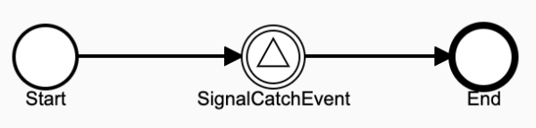
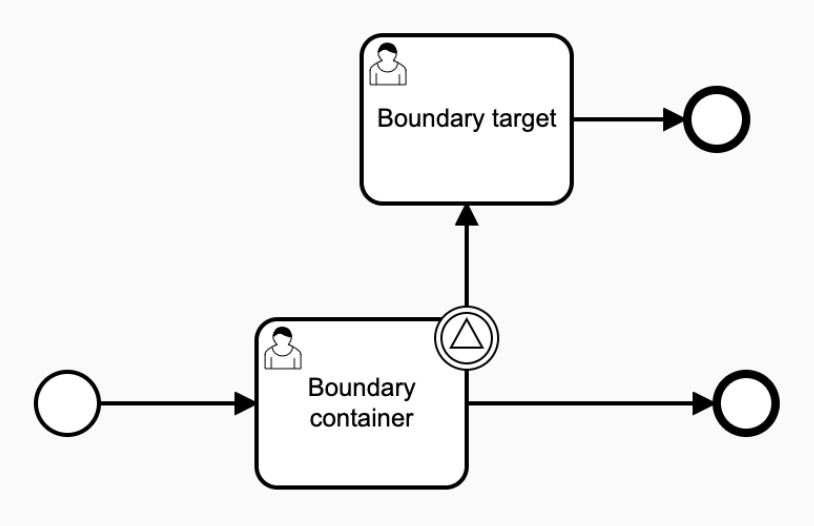
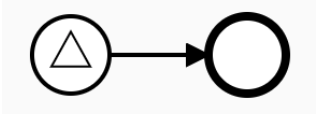

# BPMN Comformance Set 6

This scenario covers Signal events in different combinations. The [source code of these tests can be found here](https://github.com/Activiti/Activiti/tree/develop/activiti-spring-conformance-tests/activiti-spring-conformance-signals).

* [Process throwing a signal event](set-6-basic-signals.md)
  * **Start Process Operation**:
    * PROCESS\_CREATED
    * PROCESS\_STARTED
    * ACTIVITY\_STARTED
    * ACTIVITY\_COMPLETED
    * SEQUENCE\_FLOW\_TAKEN
    * ACTIVITY\_STARTED
    * ACTIVITY\_COMPLETED
    * SEQUENCE\_FLOW\_TAKEN
    * ACTIVITY\_STARTED
    * ACTIVITY\_COMPLETED
    * PROCESS\_COMPLETED

* [Process with signal intermediate catch event](set-6-basic-signals.md)
  * We should have the following events after starting this process \(process is waiting for matching signal\):
  * **Start Process Operation**
    * PROCESS\_CREATED
    * PROCESS\_STARTED
    * ACTIVITY\_STARTED
    * ACTIVITY\_COMPLETED
    * SEQUENCE\_FLOW\_TAKEN
    * ACTIVITY\_STARTED
  * **Signal Operation**
    * We should have the following events after a matching signal is sent:
    * SIGNAL\_RECEIVED
    * ACTIVITY\_COMPLETED
    * SEQUENCE\_FLOW\_TAKEN
    * ACTIVITY\_STARTED
    * ACTIVITY\_COMPLETED
    * PROCESS\_COMPLETED

* [Process with signal boundary event](set-6-basic-signals.md)
  * We should have the following events after starting the process
  * **Start Process Operation**
    * PROCESS\_CREATED
    * PROCESS\_STARTED
    * ACTIVITY\_STARTED
    * ACTIVITY\_COMPLETED
    * SEQUENCE\_FLOW\_TAKEN
    * ACTIVITY\_STARTED
    * TASK\_CREATED
  * We should have the following events after sending a signal matching with  boundary signal event:
  * **Signal Operation**
    * SIGNAL\_RECEIVED
    * TASK\_CANCELLED
    * ACTIVITY\_COMPLETED
    * SEQUENCE\_FLOW\_TAKEN
    * ACTIVITY\_STARTED
    * TASK\_CREATED

* [Signal start event](set-6-basic-signals.md)
  * We should have the following events when a signal matching the signal start event is sent:
  * **Signal Operation**
    * SIGNAL\_RECEIVED
    * PROCESS\_CREATED
    * PROCESS\_STARTED
    * ACTIVITY\_COMPLETED
    * SEQUENCE\_FLOW\_TAKEN
    * ACTIVITY\_STARTED
    * ACTIVITY\_COMPLETED
    * PROCESS\_COMPLETED

