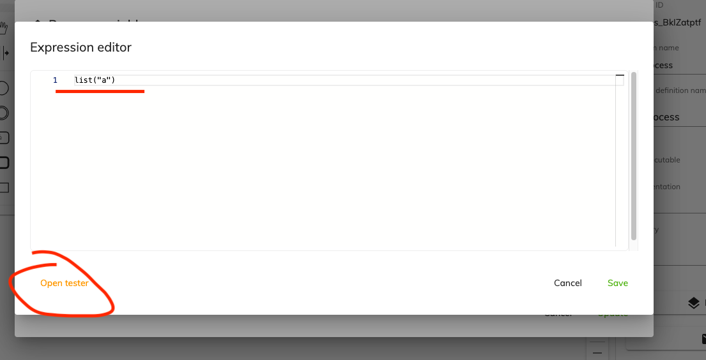

# 7.2.0

You can consume all the Activiti artifacts for this release from Alfresco Nexus:

```markup
<repositories>
  <repository>
    <id>activiti-releases</id>
    <url>https://artifacts.alfresco.com/nexus/content/repositories/activiti-releases</url>
  </repository>
</repositories>
```

_Activiti Cloud:_

```markup
<dependencyManagement>
   <dependencies>
     <dependency>
       <groupId>org.activiti.cloud</groupId>
       <artifactId>activiti-cloud-dependencies</artifactId>
       <version>7.2.0</version>
       <scope>import</scope>
       <type>pom</type>
     </dependency>
   </dependencies>
 </dependencyManagement>
```

_Activiti Core_

```markup
  <dependencyManagement>
    <dependencies>
      <dependency>
        <groupId>org.activiti</groupId>
        <artifactId>activiti-dependencies</artifactId>
        <version>7.2.0</version>
        <scope>import</scope>
        <type>pom</type>
      </dependency>
    </dependencies>
  </dependencyManagement>
```

### In release 7.2.0 you will find the following [main fixes & features](https://github.com/Activiti/Activiti/milestone/42?closed=1):&#x20;

* Fix [\[Query service\] EntityExistsException when executing a process with cycles](https://github.com/Activiti/Activiti/issues/3886)
* [Create a JUEL simulator starter](https://github.com/Activiti/Activiti/issues/3831):

JUEL Simulator Starter allows applications using it to simulate JUEL expressions. Providing sample data, the JUEL simulator checks whether the expression works as expected. For this new functionality, a new endpoint has been created located at `/v1/juel` in the modeling back end. This feature uses the JuelExpressionResolver and needs authentication. The endpoint receives two inputs variables:

* `expression`: String containing the JUEL expression.
* `variables`: Map with the names and values of the variables used in the expression (Expression context). Example:&#x20;

```json
{
  "expression": "${var1} + ${var2}"
  "variables": {
      "var1": 10,
      "var2": 20
  }
}
```

Output:

```json
{
  "result": 30
}
```

&#x20;In order to use the JUEL simulator in an application (e.g. The modeling application):&#x20;

1\. Add de maven dependency: `org.activiti.cloud:activiti-cloud-starter-juel:${activiti-cloud.version}`

```xml
<dependency>
  <groupId>org.activiti.cloud</groupId>
  <artifactId>activiti-cloud-starter-juel</artifactId>
  <version>${activiti-cloud.version}</version>
</dependency>
```

2\.  Include the `@EnableActivitiJuel` annotation

This feature has been integrated into the Modeling app:

 (1).png>)




.png>)

* [Add task assignee to expression resolver](https://github.com/Activiti/Activiti/issues/3855): in the scope of user tasks, it's possible to use the expression `${assignee}` that is available out of the box.
* [\[Query\] User should be able to see all the tasks when he is the initiator or involved in the process](https://github.com/Activiti/Activiti/issues/3836): see section [API changes](7.2.0.md#api-changes).
* [Only the initiator should be able to see processes](https://github.com/Activiti/Activiti/issues/3838): see section [API changes](7.2.0.md#api-changes).
* [Only the initiator can access a process instance and perform actions on it](https://github.com/Activiti/Activiti/issues/3850): see section [API changes](7.2.0.md#api-changes).
* [Add information about current user allowed operations when retrieving a task by Id](https://github.com/Activiti/Activiti/issues/3845): the endpoint `GET /query/v1/tasks/{taskId}` returns one extra property (`permissions`) that identifies which  are the permissions the current user has on the given task:
  * `VIEW`: the user can view the task
  * `CLAIM`: the user can assign the task to himself
  * `RELEASE`: the user can release the task that it's currently assigned to him
  * `UPDATE`: the user can update information related to the task

```json
{
  "entry": {
    "name": "Claimable task",
    "permissions": [
      "VIEW",
      "CLAIM"
    ]
  }
}
```

## Changes from previous versions

### Versioning

Activiti is changing the way the project is released: so far the pattern `7.x.y` was used for internal releases (created every time a new commit is merged on the `develop` branch). For instance, `7.1.364` is an internal release. In addition to the internal releases, intermediate milestones were published on regular bases, (e.g. `7.1.0-M17`), and eventually, a general availability (GA) version would be released (e.g. `7.1.0-GA`).&#x20;

In order to simplify the management of the releases and avoid confusion, it has been decided that internal versions should use pre-releases suffixes, i.e. `-alpha` (`7.2.0-alpha.1`, `7.2.0-alpha.2`). In addition to that, milestones releases will no longer be published and will be replaced by a new minor version that will be released more often. It has also been decided that the version `7.1.0-GA` will be skipped and the project will go straight to the version `7.2.0`.

## API changes

This version comes with the following changes in the APIs:

* **Query service**: the behavior of the endpoint `GET /query/v1/task/{taskId}` has changed allowing a user to retrieve by id all the tasks where he is the initiator of the process or he is involved in at least 1 task of the process (he is a candidate, the assignee, in a candidate group). Previously only the tasks for which the user was the assignee or a candidate were returned.&#x20;
* **Query service**: the behavior of the endpoint `GET /query/v1/process-instance/{process-id}/tasks` has changed allowing a user to retrieve only the tasks where he is the initiator of the process or he is involved in at least 1 task of the process (he is a candidate, the assignee, in a candidate group). Previously all the tasks were returned.
* **Query service**: new endpoint `GET query/admin/v1/process-instance/{process-id}/tasks` allowing an admin to retrieve all the tasks in the scope of a given process instance.
* **Query service**: `GET /query/v1/process-instances` will return only the instances started by the current user. Use the admin API in the case where all the process instances should be returned.
* **Query service**: `GET /query/v1/process-instances/{processInstanceId}`. Only the initiator and users involved in the process will be able to to retrieve the process by id.
* **Runtime bundle**:  `POST /rb/v1/process-instances/{processInstanceId}/suspend.` Only the initiator can suspend the process.
* **Runtime bundle**:  `POST /rb/v1/process-instances/{processInstanceId}/resume.` Only the initiator can resume the process.
* **Runtime bundle**: DELETE /rb/v1/process-instances/{processInstanceId}. Only the initiator can cancel a process instance he started.
* **Runtime bundle**: `PUT /rb/v1/process-instances/{processInstanceId}`. Only the initiator can update the properties of a process instance.
* **Runtime bundle**: `GET`, `POST /rb/v1/process-instances/{processInstanceId}/variables`. Only the initiator can retrieve and update process variables.
* **Runtime bundle**: new endpoint `GET /rb/admin/v1/process-instances/{processInstanceId}/variables` to list all the variables of a process instance as `admin`.

